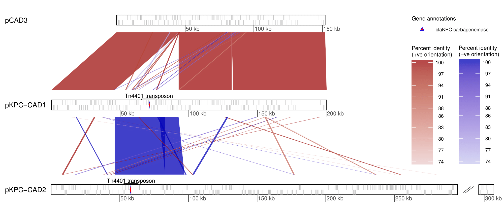

ATCG (Alignment-based Tool for Comparative Genomics) is a command-line tool for comparison of nucleotide sequence genome assemblies using [BLAST](https://www.ncbi.nlm.nih.gov/books/NBK279690/). BLAST alignments from pairwise genome comparisons are parsed to calculate metrics of overall genome relatedness, including average nucleotide identity (ANI) and various distance scores. In addition, structural similarity metrics can be calculated based on the collinearity and contiguity of alignments. Furthermore, ATCG can be used to retrieve a set of best hit alignments, which can in turn be visualised using ATCG. ATCG has been benchmarked using bacterial genomes and can comfortably handle small-to-medium sized bacterial datasets (e.g. all-vs-all comparison of ~1000 plasmids, ~100 complete genomes).


# Table of contents

* [Introduction](#introduction)
* [Requirements](#requirements)
* [Installation](#installation)
* [1. ATCG compare.py](#1-atcg-comparepy)
    * [1.1 Input](#11-input)
    * [1.2 Quick start](#12-quick-start)
    * [1.3 Background and methods](#13-background-and-methods)
    * [1.4 Options and usage](#14-options-and-usage)
    * [1.5 Output files](#15-output-files)
    * [1.6 compare.py FAQ](#16-comparepy-faq)
* [2. ATCG visualise.py](#2-atcg-visualisepy)
    * [2.1 Input](#21-input)
    * [2.2 Quick start](#22-quick-start)
    * [2.3 Background and methods](#23-background-and-methods)
    * [2.4 Options and usage](#24-options-and-usage)
    * [2.5 Output files](#25-output-files)
    * [2.6 visualise.py FAQ](#27-visualisepy-faq)
* [3. ATCG example](#3-atcg-example)
* [License](#license)


# Introduction

ATCG can be used to 1) calculate ANI and distance metrics using the `compare.py` executable; and 2) visualise pairwise genomic comparisons using the `visualise.py` executable. The ATCG `compare.py` pipeline serves a similar purpose to other tools for calculating genome similarities/distances such as [OrthoANI](https://www.ezbiocloud.net/tools/orthoani), [pyani](https://github.com/widdowquinn/pyani), the dnadiff tool from the [MUMmer](https://github.com/mummer4/mummer/blob/master/MANUAL.md) package, and [GGDC](https://www.dsmz.de/services/online-tools/genome-to-genome-distance-calculator-ggdc). The ATCG `visualise.py` pipeline is similar to tools such as [Artemis Comparison Tool](https://www.sanger.ac.uk/science/tools/artemis-comparison-tool-act) (ACT). Reasons to use ATCG rather than other available tools are detailed in the FAQ sections ([compare.py FAQ](#16-comparepy-faq) and [visualise.py FAQ](#27-visualisepy-faq)).

As input for `compare.py`, ATCG can take nucleotide sequence assemblies in (multi-)[FASTA](https://en.wikipedia.org/wiki/FASTA_format) format (compressed [gzip](https://en.wikipedia.org/wiki/Gzip) FASTAs as well as FASTA input from the [stdin stream](https://en.wikipedia.org/wiki/Standard_streams#Standard_input_(stdin)) can be handled too). For details see section [1.1 Input](#11-input). As input for `visualise.py`, ATCG requires alignment file(s) containing pairwise alignments (e.g. the alignment file produced when running `compare.py` with the `--bestblasthits` flag) and a file providing genome sequence lengths (also produced by `compare.py`). A file specifying the order in which a set of pairwise comparisons should be visualised must also be provided. Optional files include those providing gene annotation data. For details, see section [2.1 Input](#21-input).

ATCG is appropriate if you want to:
* Compare (genome) sequences in terms of ANI, distance metrics, alignment coverage breadth, and structural similarity.
* Use genomes distance scores to build a [distance-based](https://en.wikipedia.org/wiki/Distance_matrices_in_phylogeny) tree.
* Visualise pairwise comparisons between two or more sequences.

ATCG is __not__ appropriate if you want to:
* Analyse big datasets of large genomes (alignment-based approaches such as ATCG are too time-consuming). However, ATCG works well in conjunction with faster (but less informative) alignment-free approaches comparative genomic methods such as [Mash](https://mash.readthedocs.io/en/latest/). For example, after identifying pairs of similar genomes using Mash, ATCG could be used for more detailed/accurate analysis of these pairs.
* Generate a whole-genome multiple alignment. Instead, use [progressiveMauve](http://darlinglab.org/mauve/user-guide/progressivemauve.html) or similar tool.


# Requirements

* Linux or MacOS, with the [Bash shell](https://en.wikibooks.org/wiki/Bash_Shell_Scripting#What_is_Bash?), version 4 or later, installed (tested using Bash version 4.2). Bash is the default shell on MacOS and many Linux distributions.
* [Python](https://www.python.org/) 2.7 or Python 3 (tested using Python 2.7.11 and Python 3.5.2)
* [R](https://www.r-project.org/) 3.3.1 or later

__For compare.py__<br>

* [Biopython](https://biopython.org/) 1.61 or later
* [BLAST+](https://www.ncbi.nlm.nih.gov/books/NBK279690/)
* [GNU Parallel](https://www.gnu.org/software/parallel/)
* The following R packages must be installed:
    * [GenomicRanges](https://bioconductor.org/packages/release/bioc/html/GenomicRanges.html); [gsubfn](https://cran.r-project.org/web/packages/gsubfn/index.html); [purrr](https://github.com/tidyverse/purrr); [foreach](https://cran.r-project.org/web/packages/foreach/index.html); [doParallel](https://cran.r-project.org/web/packages/doParallel/index.html); [data.table](https://cran.r-project.org/web/packages/data.table/index.html); [ape](https://cran.r-project.org/web/packages/ape/index.html)<br>

Run the following code in R to install the required R packages:<br>
```bash
if (R.Version()$major >3 || (R.Version()$major==3 && R.Version()$minor >= 5.0)) {
  if (!requireNamespace("BiocManager", quietly = TRUE))
    install.packages("BiocManager")
  BiocManager::install()
  BiocManager::install(c("GenomicRanges"))
} else {
  source("https://bioconductor.org/biocLite.R")
  biocLite("GenomicRanges")
}
install.packages("devtools",repo='https://cloud.r-project.org/')
library(devtools)
devtools::install_github("ggrothendieck/gsubfn")

install.packages("purrr",repo='https://cloud.r-project.org/')
install.packages("foreach",repo='https://cloud.r-project.org/')
install.packages("doParallel",repo='https://cloud.r-project.org/')
install.packages("data.table",repo='https://cloud.r-project.org/')
install.packages("ape",repo='https://cloud.r-project.org/')
```

If you have trouble installing the devtools package, see this [Issue](https://github.com/AlexOrlek/ATCG/issues/1) - you may need to install a few additional dependencies.


__For visualise.py__<br>

* [BCBio](https://pypi.org/project/bcbio-gff/)
* The following R packages must be installed:
    * [GenomicRanges](https://bioconductor.org/packages/release/bioc/html/GenomicRanges.html); [genoPlotR](http://genoplotr.r-forge.r-project.org/); [gsubfn](https://cran.r-project.org/web/packages/gsubfn/index.html); [dendextend](https://cran.r-project.org/web/packages/dendextend/index.html); [ape](https://cran.r-project.org/web/packages/ape/index.html); [ggplot2](https://cran.r-project.org/web/packages/ggplot2/index.html); [cowplot](https://cran.r-project.org/web/packages/cowplot/index.html)<br>

Run the following code in R to install the required R packages:<br>
```bash
if (R.Version()$major >3 || (R.Version()$major==3 && R.Version()$minor >= 5.0)) {
  if (!requireNamespace("BiocManager", quietly = TRUE))
    install.packages("BiocManager")
  BiocManager::install()
  BiocManager::install(c("GenomicRanges"))
} else {
  source("https://bioconductor.org/biocLite.R")
  biocLite("GenomicRanges")
}

install.packages("devtools",repo='https://cloud.r-project.org/')
library(devtools)
devtools::install_github("ggrothendieck/gsubfn")

install.packages("genoPlotR",repo='https://cloud.r-project.org/')
install.packages('dendextend',repo='https://cloud.r-project.org/')
install.packages("ape",repo='https://cloud.r-project.org/')
install.packages("ggplot2",repo='https://cloud.r-project.org/')
install.packages("cowplot",repo='https://cloud.r-project.org/')
```


# Installation

```bash
git clone https://github.com/AlexOrlek/ATCG.git
cd ATCG
```
You should find the executable scripts (`compare.py` `getfeatureinput.py` `visualise.py`) within the repository directory. If you add the path of this directory to your [$PATH variable](https://www.computerhope.com/issues/ch001647.htm), then ATCG can be run by calling the executable scripts e.g. `compare.py [`*`arguments...`*`]` from any directory location. Note also that ATCG expects the tools listed in [Requirements](#Requirements) to be available in your $PATH variable.

# 1. ATCG compare.py

## 1.1 Input

Nucleotide sequence assemblies must be provided in [FASTA](https://en.wikipedia.org/wiki/FASTA_format) format. There are 3 different input options, which determine how comparisons between input genomes are conducted. The input option also determines how input should be provided (e.g. as files or filepaths). Figure 1 below summarises how the 3 input options (`-s` flag, `-1` and `-2` flags, `-p` flag) determine comparisons, and each option is described in more detail below. 

<br>
<p align="center">Figure 1. Summary of input options</p>
<p align="center"></p>

*The simplest way to run all-vs-all comparisons is with the `-s` flag, but the Figure shows how all 3 input flags could be used to conduct all-vs-all comparions between genomes A, B, and C (in the case of the `-1/2` flags, 2 separate runs are required). Comparisons are indicated using green ticks or lines. Note that by default, comparisons will be uni-directional from query to subject i.e. in the case of the `-s` flag example: B -> A, C -> A, C -> B. However if the `--bidirectionalblast` flag is provided, then comparisons will be run in both directios i.e. in the case of the `-s` flag example, the top right corner of the comparison matrix will be filled with ticks*


__-s flag input for all-vs-all comparison__<br>
The `-s` flag option implements all-vs-all comparisons between a set of genomes, which can be provided to the flag in various ways. 

1. The flag can be provided with a directory containing FASTA files, which are recognised based on suffix (FASTA suffix must be ".fa" ".fna" or ".fasta"; compressed FASTAs should be additionally suffixed with ".gz" i.e. full suffix ".fa.gz"). Each FASTA file should correspond to a genome; an incomplete genome assembly or a complete genome assembly comprising multiple sequences (chromosome, plasmids) is provided as a single multi-FASTA file. 

2. The flag can be provided with a single multi-FASTA file. In this case, genomes must be delimited by the format of the FASTA header line identifiers. Specifically, vertical bars in the header identifier in the format `genome|contig` indicate the affiliation of sequences with genomes. For example, to compare genomes where at least some genomes are incompletely assembled (comprising contigs), FASTA headers could be formatted as follows:
<br>

```
genome1|contig1 additional information could be provided in the header line description (any text appearing after a space)
genome1|contig2|additional information could also be provided in the header line identifier after genome|contig|
genome2|contig1
genome3 for a complete genome comprising a single sequence, contig does not need to be specified 
```

3) Following the same header formatting rules given above, input can also be provided from the stdin stream e.g. `-s <(output_fasta_script.py)`.


__-1 and -2 flag input for query-subject comparison__<br>
Comparisons can be specified between one or more query genomes (provided to the `-1` flag) and one or more subject genomes (provided to the `-2` flag). Sets of genomes provided to the two flags should be non-overlapping i.e. no genome should appear in both `-1` and `-2` input. Similar to when using the `-s` flag, the `-1`/`-2` flags can be provided with input from two directories containing FASTA files, from two FASTA files, or from two stdin streams. In the case of file or stdin stream input, genomes must be delimited according to FASTA header formatting rules described above. Figure 1 shows how an all-vs-all comparison can be conducted in two steps using the `-1`/`-2` flags (in practice, the `-s` flag is the most straightforward way to conduct all-vs-all comparisons).

__-p flag for comparison of a set of genome pairs__<br>
Comparisons can be specified between a set of genome pairs using the -p flag. The -p flag must be provided with a tsv file containing filepaths to FASTA files in two columns; each row contains two filepaths specifying a pair of genomes to be compared. Figure 1 shows how an all-vs-all comparison can be conducted using the `-p` flag with a file specifying the all-vs-all pairwise comparisons (in practice, the `-s` flag is the most straightforward way to conduct all-vs-all comparisons).

__Additional notes on input flags__<br>
Genome names (for labelling in output files) are determined as follows: for directory input or `-p` flag input, genome name is the file name with suffix excluded; for file or stdin input, genome name is extracted from the FASTA headers.

By default, `compare.py` runs BLAST comparisons in one direction (see [Options and usage](#14-options-and-usage)); BLAST results are non-symmetric in that they differ slightly if query/subject input are switched. In addition it is more efficient to query a large set of genomes against a smaller set of subjects, leading to slightly improved runtimes. Overall, this isn't something to be concerned about. But be aware that unless `--bidirectionalblast` is specified, results will differ according to which set of genomes is provided to the `-1` (query) flag and which to the `-2` (subject) flag. For -s and -p flag input, query and subject input is determined according to alphabetic order of genome names.


## 1.2 Quick start

The example code below runs all-vs-all comparison between all FASTA files in the `fasta_input_directory`. In addition to default outputs (see [1.5 Output files](#15-output-files)), structural similarity statistics are calculated (`--breakpoint` and `alnlenstats` flags), and a matrix of ANI scores is produced (`--matrix Average_nucleotide_identity`):

`compare.py -s fasta_input_directory -o output_directory --breakpoint --alnlenstats --matrix Average_nucleotide_identity`

The example code below runs comparisons between a set of queries and a reference genome

`compare.py -1 queries.fa -2 reference.fa -o output_directory`

The example code below runs comparisons specified in the comparisons.tsv file

`compare.py -p comparisons.tsv -o output_directory`


## 1.3 Background and methods

A brief outline of the steps of ATCG `compare.py` is given below:

1. FASTA input is parsed using [Biopython](https://biopython.org/) to extract genome names and determine lengths of the sequences contained in the input (multi-)FASTA(s). BLAST databases are created for each genome.
2. Genomes are aligned using BLAST; the input flag determines how pairwise BLAST between input genomes is conducted (see [1.1 Input](#11-input)). By default BLAST is run in one direction only, but if the `--bidirectionalblast` flag is provided, bi-directional BLAST is run i.e. genome A vs genome B AND genome B vs genome A; that is, with genome A as the [query sequence](https://www.ncbi.nlm.nih.gov/books/NBK1734/) and genome B as the subject database sequence, and vice-versa).
3. BLAST alignments are parsed, using the [GenomicRanges](https://bioconductor.org/packages/release/bioc/html/GenomicRanges.html) R package, as follows:
    * Overall, analysis proceeds by iterating through alignments associated with each subject genome, and adopting a [split-apply-combine](https://stackoverflow.com/tags/split-apply-combine/info) strategy; specifically, at each iteration, alignments are split by query genome such that analysis is performed on alignments representing query-subject pairs, and results are combined at the end to produce a single file with statistics for each comparison.
    * If a genome comprises multiple sequences, query and subject alignment ranges for that genome are initially shifted so that ranges from different different contigs of the same genome do not overlap (equivalent to concatenating contigs prior to analysis). 
    * Alignment ranges on query and subject genomes are converted to sets of non-overlapping ranges, favouring retention of ranges from higher-scoring alignments; suboptimal alignments are excluded, or truncated to the endpoint of a higher-scoring alignment, with which they only partially overlap.
    * At this stage, percent identity and coverage breadth statistics are calculated from the non-overlapping ranges on query and subject genomes. If outputting `--bestblastalignments` then ranges are shifted back to original values and best hit BLAST alignments are produced; best hit BLAST alignments are the set of original BLAST alignments that are represented in the non-overlapping ranges of query and/or subject genome.
    * Alignments that are not represented in both query and subject genome are excluded, leaving a common set of non-overlapping alignments. If `--breakpoint` or `--alnlenstats` flags are provided, breakpoint and alignment length statistics are calculated at this stage. Breakpoint statistics are based on alignment adjacency breakpoints. The alignment length statistics provide information on the distribution of BLAST alignment lengths (i.e. they reflect alignment contiguity) and are analogous to the widely used [assembly contiguity statistics](https://www.molecularecologist.com/2017/03/whats-n50/) e.g. N50/L50. By default a length filter of 100bp is applied to alignment ranges prior to calculating breakpoint distance and alignment length statistics. The rationale for the flag is as follows: short remnants of suboptimal alignments (the flanks that did not overlap the best alignment) may remain. Excluding these alignments whilst retaining longer (e.g. at least gene-sized) alignments should reduce bias when calculating breakpoint distance and alignment length statistics.
    * For each alignment, the shortest range from query/subject sequence is identified, and from the union of these ranges ANI and distance scores are calculated. 
4. If all-vs-all BLAST was run, then in addition to recording statistics in the comparisonstats.tsv file, ANI or distance scores can be output in matrix format. In addition, trees can be generated from distance scores; a hierarchical clustering dendrogram can be built using the [hclust](https://www.rdocumentation.org/packages/fastcluster/versions/1.1.25/topics/hclust) function with the complete linkage method. Alternatively, a phylogeny can be built using the balanced minimum evolution method ([Desper and Gascuel 2002](https://www.ncbi.nlm.nih.gov/pubmed/12487758)).


A description of the statistics produced by ATCG, and formulae for their calculation are given [here](misc/statistics_calculation.pdf).

At each step above, multi-threading (using the `-t` flag) can reduce runtimes: BLAST databases can be created in parallel; BLAST can be run with multiple threads; alignments can be parsed in parallel.

See the [Example](#3-atcg-example) below for a visual depiction of how the alignment parsing steps described above work. 

The rationale for the alignment parsing steps described above is explained in the [compare.py FAQ](#16-comparepy-faq).


## 1.4 Options and usage

Running `compare.py -h` produces a summary of the most commonly used options:

```
usage: compare.py [-h] [--help_all] [-s SEQUENCES] [-1 SEQUENCES1]
                  [-2 SEQUENCES2] [-p SEQUENCEPAIRS] -o OUT [-m  [...]]
                  [--treedistscore  [...]] [--treemethod  [...]]
                  [--breakpoint] [--alnlenstats] [--bestblastalignments]
                  [--evalue EVALUE] [--wordsize WORDSIZE]
                  [--task {blastn,dc-megablast,megablast}]
                  [--bidirectionalblast] [-l LENGTHFILTER] [-t THREADS]
                  [--blastonly] [--keep {0,1,2}]

ATCG: Alignment Based Tool for Comparative Genomics

Help:
  -h, --help            Show a help message explaining commonly used software options.
  --help_all            Show a help message explaining all software options.

Input:
  -s SEQUENCES, --sequences SEQUENCES
                        Sequences, for all-vs-all pairwise comparison (required if -1 and -2 flags and -p flag not provided)
  -1 SEQUENCES1, --sequences1 SEQUENCES1
                        First set of sequence(s), for pairwise comparison against second set (required if -s flag and -p flag not provided)
  -2 SEQUENCES2, --sequences2 SEQUENCES2
                        Second set of sequence(s), for pairwise comparison against first set (required if -s flag and -p flag not provided)
  -p SEQUENCEPAIRS, --sequencepairs SEQUENCEPAIRS
                        A .tsv file containing two columns, with filepaths to fasta files. Each row of the file defines a pair of sequences to be compared (required if -1 and -2 flags and -s flag not provided)

Output:
  -o OUT, --out OUT     Output directory (required)
  -m  [ ...], --matrix  [ ...]
                        Applies to all-vs-all comparison only. Average nucleotide identity/distance score matrices to output; can specify multiple parameters. Options: Average_nucleotide_identity; DistanceScore_d0 through to DistanceScore_d9; Breakpoint_distance_d0, Breakpoint_distance_d1
  --treedistscore  [ ...]
                        Applies to all-vs-all comparison only. Distance score to use to construct tree; can specify multiple parameters
  --treemethod  [ ...]  Applies to all-vs-all comparison only. Tree building method; can specify dendrogram and/or phylogeny
  --breakpoint          If flag is provided, calculate breakpoint statistics (default: do not calculate)
  --alnlenstats         If flag is provided, calculate alignment length distribution statistics (default: do not calculate)
  --bestblastalignments
                        If flag is provided, write to file best blast alignments for each genome (default: do not output)

BLAST options:
  --evalue EVALUE       BLAST e-value cutoff (default: 1e-15)
  --wordsize WORDSIZE   BLAST word size (ATCG default for blastn: 38; ATCG default for dc-megablast: 12; ATCG default for megablast: 28)
  --task {blastn,dc-megablast,megablast}
                        BLAST task (default: blastn)
  --bidirectionalblast  If flag is provided, BLAST is conducted in both directions and results are averaged (slower runtime) (default: conduct BLAST in one direction only)

Alignment parsing options:
  -l LENGTHFILTER, --lengthfilter LENGTHFILTER
                        Length threshold (in basepairs) used to filter alignments prior to calculating breakpoint distance and alignment length statistics (default: 100)

Other:
  -t THREADS, --threads THREADS
                        Number of threads to use (default: 1)
  --blastonly           If flag is provided, only output pairwise blast results; do not calculate distance statistics (default: run full pipeline)
  --keep {0,1,2}        Level of file retention (default: 0)
                           0 = do not retain blast database or blast table output,
                           1 = do not retain blast database output,
                           2 = retain all intermediate output
```

To see all options, run `compare.py --help_all`. Below are notes on some of the additional options produced with the `--help_all` flag:

__Options relating to BLAST__: `--blastonly` terminates the pipeline after BLAST alignments are produced; alignments will not be parsed to produce ANI/distance statistics. `--cullinglimit` is used to set the BLAST culling limit parameter. 

__Generating bootstrap confidence values (not recommended)__: [Previous authors](https://bmcbioinformatics.biomedcentral.com/articles/10.1186/1471-2105-14-60) describe a procedure for calculating confidence intervals for distance scores through bootstrap-resampling. However, running bootstrapping increases runtime, and as the authors note, in-depth asessment of the procedure is lacking, so it should be used cautiously. By default, bootstrapping is not conducted. `-b 100` would bootstrap re-sample alignments 100 times; if outputting a tree, then bootstrap confidence values would be plotted.

__Deprecated methods (not recommended)__: `--keepsuboptimalalignmentfragment`, `--statsfromreciprocallytrimmed` and `--reciprocallytrimmedalignments` are flags relating to deprecated methods.


## 1.5 Output files

The below table shows the most important outputs from running the pipeline with `--keep 0` (default), and using the `-s` input flag. Similar outputs are produced using `-1/-2` and `-p` input flags.

File/Directory          | Description                                                                                       
----------------------- | -------------------------------------------------------------------------------------------------
filepathinfo.tsv        | genome names and associated file paths
seqlengths.tsv          | sequence names (in genome|contig format) and their lengths in bp
blastsettings.txt       | record of BLAST settings
included.txt            | names of genomes with detected blast alignments, that will therefore appear in the comparisonstats.tsv file
excluded.txt	          | names of any genomes with no detected blast alignments (this file may be blank)
excludedcomparisons.tsv | pairwise comparions yielding no BLAST output are recorded here (this file may be blank)
output/		              | directory containing output files described below
comparisonstats.tsv     | ANI and distance statistics for each unique pairwise combination of genomes

If all-vs-all comparison (`-s`) flag is run and matrix output is specified, matrix files will be labelled in the format `matrix_score.tsv`, where score is the parameter provided to the `-m` flag. If tree output is specified, files will be labelled in the format `dend_score.pdf` for a hclust dendrogram and `phylo_score.pdf` for a phylogeny built using the minimum evolution method. As well as .pdf files, [.rds](https://stat.ethz.ch/R-manual/R-devel/library/base/html/readRDS.html) files storing the tree objects are saved; the .rds files can be read to regenerate the tree file for further analysis/re-plotting.

If the `--bestblastalignments` flag is provided, then one alignment file, containing best blast alignments, will be produced per subject genome. By default, this means not all genomes will have a corresponding alignment file (see Figure 1 - with uni-directional BLAST not all genomes serve as subjects in a BLAST search) but with the `--bidirectionalblast` flag, all genomes are run as subjects.


## 1.6 compare.py FAQ

* **What is the rationale for the alignment parsing procedure?**
The result of running BLAST is usually a rather chaotic set of overlapping alignments from which a reliable estimate of ANI, or any other useful statistic, cannot be immediately derived. Overlapping alignments partly reflect the BLAST algorithm per se - rather than a minimal set of optimal alignments, BLAST produces all alignments fulfilling specified (evalue) thresholds. Overlapping alignments may also reflect paralogy i.e. mutliple stretches of repeat sequence from one genome mapping to a single homologous stretch in the other genome. ATCG alignment parsing first ensures alignment ranges on query and subject are non-overlapping. Some statistics, notably coverage breadth on each genome pair, are calculated at this stage. However, paralogous sequence may still be retained, and including duplicate copies of a paralogous sequence in calculations will bias ANI and distance metrics. Subsequent alignment parsing steps therefore aim to eliminate bias from repetitive sequence prior to ANI/distance score calculation.
* **What happens if there are no BLAST alignments between two genomes?**
Pairwise comparisons yielding no BLAST alignments will not be included in the comparisonstats.tsv output file, and such comparisons will be recorded in the excludedcomparisons.tsv file. In any `--matrix` output, excluded comparisons will be recorded as "NA"; note that tree(s), if specified, will not be produced if there are missing comparisons among any of the genomes included in comparisonstats.tsv (a warning message will be produced). Genome(s) with no BLAST alignments to any other genome(s), i.e. not appearing at all in comparisonstats.tsv, will be recorded in the excluded.txt file and will not appear in any specified matrices or trees. If no blast alignments are produced from any of the pairwise comparisons, the pipeline will be terminated with a warning message.
* **Which distance score should be used to build a distance-based tree?**
Different distance scores reflect different distance concepts. Some distance scores focus on coverage breadth (d0-d3); others focus on percent identiy (d4,d5); while others reflect both percent identity and coverage breadth (d6-d9). In addition, there are two overarching distance concepts by which the scores can be categorised: [resemblance and containment](https://genomeinformatics.github.io/mash-screen). Resemblance is not robust to genome size difference, so if a smaller genome matches exactly to part of a larger genome, the distance will be >0, but according to containment, the distance score should be 0. Scores d0, d2, d6, and d8 represent resemblance, while scores d1, d3, d7, and d9 represent containment.
* **Which breakpoint distance metric should be used?**
Breakpoint distance d1 is recommended; breakpoint distance d0 is provided since it has been used by previous authors. The breakpoint distance concept was originally established for gene order data (e.g. see [Sankoff _et al_. 2000](http://citeseerx.ist.psu.edu/viewdoc/summary?doi=10.1.1.2.8200&rank=2)); in this context, it has been defined as the number of breakpoints relative to the number of genes. Breakpoint distance d0 reflects this definition, as applied to the alignment order data handled by ATCG (breakpoints is divided by the number of alignment pairs). However, in the case of alignment data, there is a potential bias associated with alignment contiguity: reduced alignment contiguity will inflate the denominator. Therefore, breakpoint distance d0 is not be the most meaningful measure of structural conservation. Breakpoint distance d1 is robust to the potential bias described above, since the number of breakpoints is expressed per kilobase of aligned sequence rather than relative to the number of alignments.
* **Can ATCG be used to compare eukaryotic genomes**
ATCG has been developed with prokaryotic genomes in mind. ATCG could be applied to eukaryotic genomes too though. However, with large eukaryotic genomes, it will only be possible to handle small datasets. In addition, the simple breakpoint distance used by ATCG, based on alignment adjacency, will probably not be the best option for complex eukaryotic genomes ([Rocha 2005](https://academic.oup.com/mbe/article/23/3/513/1110176)). Instead, synteny block analysis is often applied before applying breakpoint distance, or any other metric of structural conservation ([Neafsey _et al_. 2005](https://www.ncbi.nlm.nih.gov/pubmed/25554792), [Zheng _et al_. 2018](https://www.ncbi.nlm.nih.gov/pubmed/29764371), [Drillon _et al_. 2014](https://www.ncbi.nlm.nih.gov/pmc/articles/PMC3961402/)).
* **What are the advantages of ATCG compared with other tools which calculate genome distances?**
    * ATCG is flexible in terms of input option; for example it can handle input from the stdin stream as well as gzip files - functionality not offered by other similar software tools. In addition, the different input flags allow for flexibility in terms of conducting comparisons (all-vs-all, query-vs-reference, list of genome pairs). Other software is less flexible, either allowing for all-vs-all only (e.g. pyani) or for only a single genome pair comparison per run (MUMmer dnadiff, OrthoANI).
    * ATCG calculates a wider range of statistics than any other tool. Other BLAST-based algorithms (e.g. OrthoANI) fragment input genomes, but ATCG does not. This means it is possible to assess strutural similarity and alignment contiguity (MUMmer also calculates these statistics). ATCG also calculates coverage breadth statistics. Finally, ATCG calculates distance scores which can be used to build distance based trees (the distance scores are the same as those calculated by GGDC).
    * ATCG can output a set of best blast alignments which can be used as input for comparative genomic visualisation tools such as Artemis Comparison Tool, Easyfig, and of course, the ATCG visualise.py executable.


    
# 2. ATCG visualise.py

For details on how `--bestblastalignments` output can be used as input for well established visualisation software such as Artemis Comparison Tool, see [visualise.py FAQ](#27-visualisepy-faq). This section explains how the ATCG `visualise.py` executable can be used to create comparative genomic plots using `--bestblastalignments` output.

## 2.1 Input

Sequence names in the __alignment file(s)__, __sequence length file__, and __feature file(s)__ (see below) must follow the convention outlined in section [1.1 Input](#11-input) where contigs are affiliated to genomes using a two-part format: `genome|contig`.<br>

A main input directory containing one or more __alignment files__ must be provided. Each alignment file contains alignments between a given subject genome and one or more query genomes. To specify the location of alignment files within the main input directory, a consistent file name or file path syntax must be adopted, and is specified using the `-s` flag. Each alignment file must be a tsv file containing one row per alignment, with a header including the following column names: sname, qname, sstart, send, qstart, qend, pid; alignment positions must adhere to the NCBI BLAST format (see [here](https://seqan.readthedocs.io/en/master/Tutorial/InputOutput/BlastIO.html) for details). Alignment files generated by running `compare.py` with `--bestblastalignments` can be used directly as input, and in this case the `-s` flag syntax would be bestblastalignments_GENOMENAME.tsv. NCBI BLAST tabular output tables can be used directly except that a header row must be inserted<br>

A __sequence length file__ is provided with the `-l` flag and specifies sequence names in the first column and their lengths in the second column. The sequence names in the sequence length file must correspond to sequence names in the alignment file(s) and feature file(s).<br>

Optionally, the input directory can contain a __tree file__ which can be in [nexus or newick format](https://www.zoology.ubc.ca/~schluter/R/phylogenetic/), or a [phylo object](http://www.phytools.org/eqg/Exercise_3.2/) saved as an .rds file. The tree must contain all genomes that will be included in the comparison, and the order of the comparisons (specified in the 'comparison file' - see below) must be compatible with the order of the tree branches. If the tree contains additional genomes, these will be pruned automatically.

Optionally, a feature input directory can be provided, containing __feature files__ which provide annotation data (e.g. gene annotations) in [gff3 format](https://github.com/The-Sequence-Ontology/Specifications/blob/master/gff3.md). As described below, the `getfeatureinput.py` script helps to convert annotation files into the correct format for ATCG. Column 9 of a gff3 file defines annotation attributes and associated values (defined in a list of tag-value pairs). Custom ATCG attribute tags can be used, which correspond to `visualisation.py` flags (see [Options and usage]((#24-options-and-usage)), and can be used to override the values provided to these flags. ATCG recognises the following custom attribute tag names: any text specified by the `annotationtxt_name` flag (e.g. gene, product); gene_type; text_type; text_rotation; outline; fill; lty; lwd. These define, respectively: the tag name storing annotation text; annotation symbol type; annotation text type (`mid` or `spanning`); annotation text rotation; and the annotation symbol outline colour, fill colour, line type, and line width. These attribute tag names can be used as a way to customise the visualisation at the level of the individual annotation. Note that the gene and product annotation tags are used by Genbank and prokka so should already be present (if gene and product name are known).

A __comparison file__ must be provided to specify which comparisons to visualise and an output name. The file can also be used to specify which annotations to visualise; which annotation text to visualise; and whether or not a tree should be plotted alongside the comparison plot. Each row in the comparison file specifies one set of comparisons and an associated plot (multiple rows can be provided). The columns are interpreted in the following order: subject/query genome comparisons; output name; subject/query annotations; subject/query annotation text; tree name. A blank cell or "-" indicates that a particular genome or plot element should be ommitted from the comparison. As an example, take the following row:


 | sbj1 | qry1,qry2,qry3 | out-name | sbj1 | qry1,qry2,qry3 | sbj1 | qry1,-,qry3 | tree-name |
 | ---- | -------------- | -------- | ---- | -------------- | ---- | ----------- | --------- |


This specifies that comparisons should be shown between subject1 and query genomes 1,2,3 in that order. Gene annotations should be plotted, and these annotations should be accompanied by corresponding text, with the exception of query genome 2, for which annotation text will be ommitted. A tree should also be plotted. Note that if subject/query annotation text is ommitted this means `mid` text_type will not be plotted but `spanning` text_type will remain unless inclusion/exclusion criteria are applied (see [Options and usage](#24-options-and-usage) for details).


__Getting feature annotation data in the correct format__<br>

One gff3 file per genome must be provided. Annotation files can be obtained from [NCBI](https://www.ncbi.nlm.nih.gov/genome) (in Genbank format) or by applying a standalone annotation software such as [prokka](https://github.com/tseemann/prokka). However, the annotation files from these sources cannot be directly read by ATCG. For example, although prokka annotation software outputs gff3 files, the software also replaces vertical bars '|' in sequence names with underscores '_'; this is problematic given the ATCG input format convention of using '|'.

The `getfeatureinput.py` script converts Genbank and prokka annotation files to the correct format, and ensures one file per genome. If using Genbank files, they must be in the [full format](https://widdowquinn.github.io/2018-03-06-ibioic/01-introduction/02-annotation.html) which includes feature annotations.

`getfeatureinput.py --help` produces a summary of all options and explains how to use the script.


## 2.2 Quick start

The following command will plot a simple visualisation of two genomes

`visualise.py -i input_directory -s bestblastalignments_GENOMENAME.tsv -l seqlengths.tsv -c comparisons.tsv -o output_directory`


## 2.3 Background and methods

The `visualisation.py` script primarily uses the [genoPlotR](http://genoplotr.r-forge.r-project.org/) software to visualise comparisons. genoPlotR outputs similar plots to those produced by the widely-used [Artemis Comparison Tool (ACT)](https://www.sanger.ac.uk/science/tools/artemis-comparison-tool-act), but is more flexible. The downside is that genoPlotR requires users to write R scripts, and in my experience, a considerable amount of time may be required to write a script producing a high-quality visualisation. ATCG-based visualisation addresses limitations of existing software thanks to the following methodological advantages:
* The output alignment files produced by the `compare.py` script can be used directly as input for the `visualisation.py` script.
* A short command can produce a high-quality visualisation, whilst numerous optional flags (see [Options and usage](#24-Options-and-usage)), as well as gff3 attribute tag names, can be used to achieve a high-level of customisation if desired.
* ATCG can represent comparisons between incompletely assembled genomes (comprising multiple contigs). It does so by transposing start and end positions of contigs and their alignments, such that the contigs are laid out from left to right in adjacent linear orientation. The sequence length file is used to determine position shifts. In addition to transposing sequence and alignment position data, the sequence length file is also used to transpose annotation positions.


## 2.4 Options and usage

Some option flags are identical to arguments from the genoPlotR `plot_gene_map` function, so the [genoPlotR manual](http://genoplotr.r-forge.r-project.org/pdfs/genoPlotR_manual.pdf) provides a useful reference. Running `visualisation.py -h` produces a summary of the most commonly used options:

```
usage: visualise.py [-h] [--help_all] -i INPUTDIR -s SYNTAX [SYNTAX ...] -l
                    SEQUENCELENGTHS -c COMPARISONS [-f FEATURES] -o OUT
                    [--main MAIN]
                    [--positivecols POSITIVECOLS [POSITIVECOLS ...]]
                    [--negativecols NEGATIVECOLS [NEGATIVECOLS ...]]
                    [--gffannotationtype GFFANNOTATIONTYPE [GFFANNOTATIONTYPE ...]]
                    [--output_height OUTPUT_HEIGHT]
                    [--output_width OUTPUT_WIDTH]
                    [--sequencefills SEQUENCEFILLS [SEQUENCEFILLS ...]]
                    [--sequenceoutlines SEQUENCEOUTLINES [SEQUENCEOUTLINES ...]]
                    [--sequencetypes {blocks,lines} [{blocks,lines} ...]]
                    [--dna_seg_labels DNA_SEG_LABELS [DNA_SEG_LABELS ...]]
                    [--annotation_gene_type {none,arrowheads,arrows,headless_arrows,blocks,bars,points,text,lines,side_blocks,side_bars,side_points,side_text,side_lines,introns,exons,side_exons}]
                    [--annotation_outline_col ANNOTATION_OUTLINE_COL]
                    [--annotation_fill_col ANNOTATION_FILL_COL]
                    [--annotationtxt_name ANNOTATIONTXT_NAME]
                    [--annotationtxt_rot ANNOTATIONTXT_ROT]
                    [--annotationtxt_exclusion ANNOTATIONTXT_EXCLUSION [ANNOTATIONTXT_EXCLUSION ...]]
                    [--annotationtxt_inclusion ANNOTATIONTXT_INCLUSION [ANNOTATIONTXT_INCLUSION ...]]

ATCG: Alignment Based Tool for Comparative Genomics; visualise alignments

Help:
  -h, --help            Show a help message explaining commonly used software
                        options.
  --help_all            Show a help message explaining all software options.

Input:
  -i INPUTDIR, --inputdir INPUTDIR
                        Input directory containing alignment files, and
                        (optionally) tree file(s) (required)
  -s SYNTAX [SYNTAX ...], --syntax SYNTAX [SYNTAX ...]
                        File name / file path syntax for identifying alignment
                        files and (optionally) annotation files within the
                        input/feature directories e.g.
                        bestblastalignments_GENOMENAME.tsv GENOMENAME.gff
                        (required)
  -l SEQUENCELENGTHS, --sequencelengths SEQUENCELENGTHS
                        File specifying sequence lengths (required)
  -c COMPARISONS, --comparisons COMPARISONS
                        File specifying which comparisons to visualise, output
                        file name, and (optionally) annotation data/tree name
                        (required)
  -f FEATURES, --features FEATURES
                        Input directory containing feature annotation data
                        files (optional)

Output:
  -o OUT, --out OUT     Output directory (required)

Visualisation options: miscellaneous:
  --main MAIN           Title text (default: no title text)
  --positivecols POSITIVECOLS [POSITIVECOLS ...]
                        Colours defining a colour scale reflecting percent
                        identity of positive orientation alignments e.g. red
                        yellow would plot high identity alignments red and low
                        identity alignments yellow; more than 2 colours can be
                        provided e.g. red yellow green blue (default:
                        "#9e0d0d" "#eacaca")
  --negativecols NEGATIVECOLS [NEGATIVECOLS ...]
                        As above but for negative orientation alignments
                        (default: "#0000b7" "#c7c7ef")
  --gffannotationtype GFFANNOTATIONTYPE [GFFANNOTATIONTYPE ...]
                        Specifies which annotation type(s) (column 3 of gff3
                        file) to retain (default: CDS)
  --output_height OUTPUT_HEIGHT
                        Specifies the height of the plot in inches; calculated
                        automatically unless specified
  --output_width OUTPUT_WIDTH
                        Specifies the width of the plot in inches; calculated
                        automatically unless specified

Visualisation options: sequence-related:
  --sequencefills SEQUENCEFILLS [SEQUENCEFILLS ...]
                        Fill colour(s) of sequence symbols; comma-separated
                        colours indicate colours of adjacent subsequences for
                        a given genome; space-separated colours indicate
                        colours for the different genomes in the comparison;
                        colour values will be replicated so that each sequence
                        is assigned a colour e.g. "white" will assign all
                        sequences white fill colour; "lightgray,darkgray
                        lightblue,darkblue" will assign sequences in the first
                        genome grayscale fill colours and sequences in the
                        second genome blue shade fill colours (default: white)
  --sequenceoutlines SEQUENCEOUTLINES [SEQUENCEOUTLINES ...]
                        Outline colour(s) of sequence symbols; takes
                        comma-/space-separated input to map outline colours to
                        sequences (similar to --sequencefills flag) (default:
                        black)
  --sequencetypes {blocks,lines} [{blocks,lines} ...]
                        Symbol type(s) of sequence symbols (either "blocks" or
                        "lines"); takes comma-/space-separated input to map
                        symbol types to sequences (similar to --sequencefills
                        flag) (default: blocks)
  --dna_seg_labels DNA_SEG_LABELS [DNA_SEG_LABELS ...]
                        The names of the sequences; must provide same number
                        of names as there are sequences. (default: use names
                        of dna_segs if available)

Visualisation options: annotation-related:
  --annotation_gene_type {none,arrowheads,arrows,headless_arrows,blocks,bars,points,text,lines,side_blocks,side_bars,side_points,side_text,side_lines,introns,exons,side_exons}
                        Specifies the default symbol to represent annotations
                        (default: side_bars)
  --annotation_outline_col ANNOTATION_OUTLINE_COL
                        Specifies the default outline colour of the annotation
                        symbol (default: gray)
  --annotation_fill_col ANNOTATION_FILL_COL
                        Specifies the default fill colour of the annotation
                        symbol (default: black)
  --annotationtxt_name ANNOTATIONTXT_NAME
                        The tag name in the gff file to use for annotation
                        text e.g. gene, product; unless specified, the gene
                        tag will be used where available, and otherwise the
                        product tag)
  --annotationtxt_rot ANNOTATIONTXT_ROT
                        Specifies the annotation text rotation (default: 40)
  --annotationtxt_exclusion ANNOTATIONTXT_EXCLUSION [ANNOTATIONTXT_EXCLUSION ...]
                        Exclusion criteria for text annotations, command line
                        argument(s) (optional)
  --annotationtxt_inclusion ANNOTATIONTXT_INCLUSION [ANNOTATIONTXT_INCLUSION ...]
                        Inclusion criteria for text annotations, command line
                        argument(s) (optional)
```

Note that colours can be provided either as [hexadecimals](https://www.w3schools.com/colors/colors_hexadecimal.asp) or as text descriptions that will be [recognised by R](http://www.stat.columbia.edu/~tzheng/files/Rcolor.pdf).<br>

Note that the default `--annotation_gene_type` is `side_bars`. These are tick marks divided into a top and bottom row to represent +ve and -ve strand gene annotations, respectively. `--annotation_outline_col` (default: "gray") determines the colour of the tick marks (the side_bar tick marks have no fill colour setting, but other gene_type symbols have a fill colour, controlled by `--annotation_fill_col`). Possible `--annotation_gene_type` arguments include: `none` (no annotation symbol plotted, but annotation text can still be plotted); `arrowheads` (triangles pointing right/left for +ve/-ve strand annotations). The annotation symbol settings can be overridden in the gff3 file, as decribed in the [2.1 Input](#21-input) section.

To see all options, run `visualise.py --help_all`.


## 2.5 Output files

Running the `visualisation.py` script will produce a plot as a pdf file and accompanying legend pdf file(s); a legend file shows legends mapping +ve/-ve orientation alignment colour to percent identity values. If custom annotation symbol settings have been specified in the gff, a second pdf contains a legend which maps annotation symbols to annotation text.


## 2.6 visualise.py FAQ

* **Is a special type of gff3 file required as input to represent annotation data?**
No, ATCG takes a standard gff3 file. The reason for needing to convert a prokka gff3 to an ATCG-compatible gff3 file is that the prokka gff3 is arguably a non-standard format. Firstly, vertical bars in sequence names are substituted for underscores. Secondly, prokka includes additional data in the gff3 such as the full FASTA sequence at the bottom of the file. Whilst ATCG takes standard gff3 files, you must ensure that there is one file for each genome represented in the comparison. Using the `getfeatureinput.py` script is a good way to ensure compatible gff3 files are available on a per-genome basis.
* **What settings should I use to make nice-looking and informative comparative genomic visualisations?**
This depends on how large the sequences that you want visualise are but some tips are given below:
    * For sub-sequences or small genomes (<100kb), the arrowheads gene_type may work well, but for larger genomes the side_bars are likely to work better since they represent gene annotations more compactly. side_bars is the default annotation symbol; however, a custom annotation symbol such as arrowheads can be used in addition to side_bars for the purpose of highlighting genes of interest. Because an annotation legend will be produced in this case, there is no need to clutter the main plot with annotation text.
    * If you do want to plot annotation text in the main plot, it is best to use short names (e.g. gene names not product names). The space allocated for annotation text is determined based on the longest annotation text name so if most annotation text names are short but one is very long the plot will not look good.
    * Legends are saved to separate pdf files, so you will need to use software (e.g. from the Adobe suite) to place the legends alongside the main plot.
* **Can ATCG be used to visualise eukaryotic genome comparisons?**
Yes, like genoPlotR, ATCG recognises introns/exons (commonly found in eukaryotic genomes) and uses the genoPlotR `exons` and `introns` gene_type symbols accordingly; the complete gene is indicated using `spanning` text_type.
* **Is there anything I need to watch out for when using ATCG to visualise genome comparisons?**
    * If annotations are specified, make sure that the annotation files contain at least one annotation (and by default, only CDS annotations are read). If you have compared sub-sequences of a larger genome, and you wish to plot annotations, make sure that the annotation positions correspond to the positions of the sub-sequences rather than the complete genome. For example, on the NCBI Genbank website, you can specify start and end positions prior to downloading a Genbank annotation file; in this case, the annotation positions will correspond to the sub-sequence defined by the start/end positions.
    * When dealing with circular genomes, occasionally, the linear sequence assembly may have split a gene in two. As an example, see Refseq accession NZ_CP026210.1, which can be found on [NCBI nucleotide](https://www.ncbi.nlm.nih.gov/nucleotide/); the gene encoding the protein WP_004187323.1 is split; the start and end position of the gene are 1 and 76261 respectively - this is the length of the complete sequence. The gff file generated by `getfeatures.py` will represent the split gene as exons belonging to a gene of length 76261, which is clearly not what you want. Instead, delete the gene and edit the exons so that they are represented as individual genes, with the same text annotation.
* **What are the advantages of ATCG visualisation compared with other comparative genomic visualisation tools?**
    * ATCG visualise.py integrates well with outputs from compare.py. For example, ANI/distance scores from compare.py can be used to select pairs of similar genomes for visualisation. In addition, `--bestblastalignments` from compare.py can be used as input for visualise.py (as well as other visualisation tools). In contrast, when using other tools such as Artemis Comparison Tool, the following pre-visualisation steps are left up to the user: generating pairwise BLAST alignments; parsing alignments to select best hits; interpreting BLAST results in order to select a set of (similar) genomes for visualisation. Because selecting a set of best BLAST alignments is non-trivial, many BLAST-based visualisation are cluttered with many suboptimal alignments.
    * Visualisations between incomplete genome assemblies is possible; other tools such as ACT and Easyfig do not handle incomplete contig assemblies.


# 3. ATCG example

Here, I demonstrate how - using a small number of commands - ATCG can generate a plot similar to the one shown in a study by [Decraene _et al_. 2018](https://aac.asm.org/content/62/12/e01689-18.long) (see Fig.4A). In the study, the authors applied comparative genomic analysis to plasmids isolated from an antibiotic resistant hospital outbreak. They found that a successful plasmid called pKPC-CAD1 (carrying a blaKPC resistance gene) is highly similar to another plasmid from the outbreak called pCAD3. However, the resistance gene region of pKPC-CAD1 showed similarity to that of another plasmid, called pKPC-CAD2. So, they hypothesized that a pCAD3-like plasmid recombined with a pKPC-CAD2-like plasmid to produce pKPC-CAD1.<br>

A multi-FASTA file containing sequences from the 3 plasmid genomes can be found in the resistance-plasmid-example/sequences directory. From the FASTA headers you will see that one genome (pKPC-CAD2) comprises 2 contigs. First, navigate to the resistance-plasmid-example directory and run the `compare.py` script, as follows, in order to generate statistics as well as an optimal set of BLAST alignments:<br>

`compare.py -s sequences/plasmids.fasta -o output_compare --breakpoint --alnlenstats --bestblastalignments`

The output, shows that, across 79% of its length, pKPC-CAD1 is >99% similar to pCAD3, while across 37% of its length, pKPC-CAD1 is 99% similar to pKPC-CAD2. Note that these statistics differ slightly from those presented in the paper, due to differences in assembly and genome alignment settings.<br>

A gff3 annotation file (generated by running prokka on the sequences) is stored in the resistance-plasmid-example/annotations. Navigate to this directory, and use the `getfeatureinput.py` script to split the prokka annotation file on a per-genome basis, while ensuring the gff3 is correctly formatted for ATCG visualisation:<br>

`getfeatureinput.py -t prokka -i annotations/plasmids.gff -o annotations -s output_compare/seqlengths.tsv`

Finally, visualise the alignments. Note that the attributes field of the gff3 contains customised "gene_type", "outline" colour, and "fill" colour tag-value pairs so that the KPC gene will be highlighted. Also, the gff3 includes annotations representing a transposon called Tn4401 which harbours the blaKPC gene; the transposon is visualised using a spanning text annotation.<br>

`visualise.py -i output_compare/output -s bestblastalignments_GENOMENAME.tsv GENOMENAME.gff -l output_compare/seqlengths.tsv -c comparison.tsv -o output_visualisation -f annotations/ --annotationtxt_name annotationtext`

<br>
<p align="center">Figure 2. Comparative genomic visualisation of plasmids from a hospital outbreak of carbapenemase-producing Enterobacterales</p>
<p align="center"></p>
<br>

Note that the plot differs slightly from Fig.4A in the paper, due to differences in assembly methods and genome alignment methods.


# License

[MIT License](https://en.wikipedia.org/wiki/MIT_License)