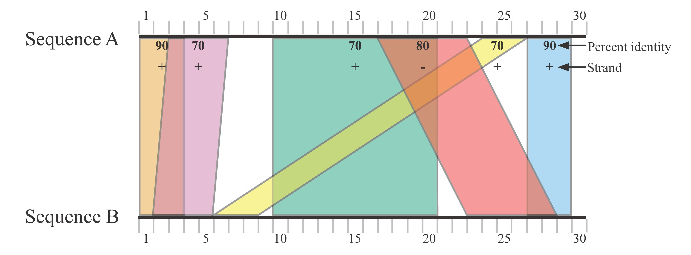
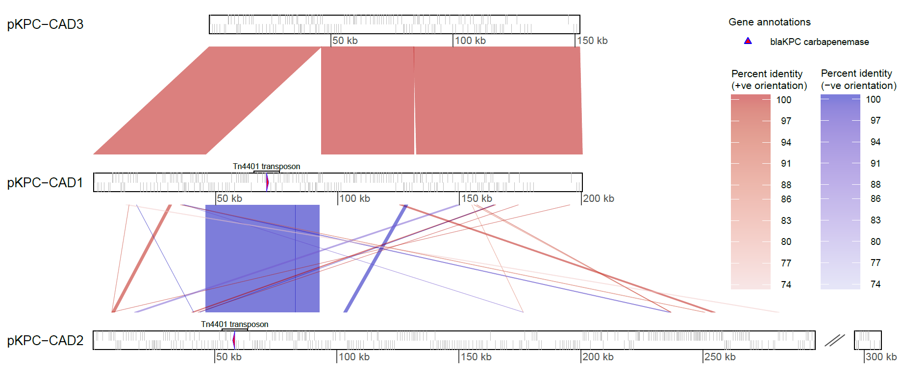

ATCG (Alignment-based Tool for Comparative Genomics) is a command-line tool for comparison of nucleotide sequences; it is intended for small-to-medium-sized datasets (e.g. <1000 plasmids; <100 bacterial genomes). The main analysis step of ATCG involves generating [BLAST](https://www.ncbi.nlm.nih.gov/books/NBK279690/) alignments, which are then analysed to calculate various overall measures of pairwise sequence similarity (expressed as distance metrics). In this respect, ATCG is similar to a web-based tool called the genome-genome distance calculator ([GGDC](https://ggdc.dsmz.de/ggdc.php#)). However, ATCG provides more flexibility and additional analysis options such as assessment of structural similarity. Notably, as a secondary analysis step, alignments from sequences of interest can be visualised; outputs are similar to those generated by the [Artemis Comparison Tool (ACT)](https://www.sanger.ac.uk/science/tools/artemis-comparison-tool-act), but ATCG offers additional flexibility.


# Table of contents

* [Introduction](#introduction)
* [Requirements](#requirements)
* [Installation](#installation)
* [1. Distance metrics](#distance-metrics)
    * [1.1 Input](#11-input)
    * [1.2 Quick start](#12-quick-start)
    * [1.3 Background and methods](#13-background-and-methods)
    * [1.4 Options and usage](#14-options-and-usage)
    * [1.5 Output files](#15-output-files)
    * [1.6 Example](#16-example)
    * [1.7 FAQ](#17-faq)
* [2. Visualisation](#visualisation)
    * [2.1 Input](#21-input)
    * [2.2 Quick start](#22-quick-start)
    * [2.3 Background and methods](#23-background-and-methods)
    * [2.4 Options and usage](#24-options-and-usage)
    * [2.5 Output files](#25-output-files)
    * [2.6 Example](#26-example)
    * [2.7 FAQ](#27-faq)
* [License](#license)


# Introduction

As input for distance metric calculation, ATCG can take nucleotide sequence assemblies in [FASTA](https://en.wikipedia.org/wiki/FASTA_format) format; the assemblies can comprise any of the following:

* Complete genomes (e.g. plasmids; small collections of bacterial genomes)
* Complete metagenomes (e.g. sets of bacterial plasmids, where each set comprises plasmids from a single bacterial isolate)
* Incomplete genome/metagenome sequences (or a combination of complete/incomplete sequences). Incomplete sequences (contigs or scaffolds) must be affiliated to a known genome or metagenome and this affiliation is indicated in the sequence's FASTA header (see section [1.1 Input](#11-input))

As input for comparative genomic visualisation, ATCG can take the trimmed alignment file generated by the distance metric calculation step (see section [1.5 Output files](#15-output-files)), or a similar alignment file from another source. For details, see section [2.1 Input](#21-input) 

ATCG is appropriate if you want to:
* Compare sequences in terms of overall similarity metrics (genome-genome distances, percentage identity, coverage breadth)
* Use pairwise genome-genome distance scores to build a [distance-based](https://en.wikipedia.org/wiki/Distance_matrices_in_phylogeny) tree.
* Compare sequences in terms of their structural similarity (using breakpoint distance metrics; see [Sankoff _et al_. 2000](http://citeseerx.ist.psu.edu/viewdoc/summary?doi=10.1.1.2.8200&rank=2) and [Auch _et al_. 2006](https://bmcbioinformatics.biomedcentral.com/articles/10.1186/1471-2105-7-350) for background information).
* Visualise pairwise comparisons between two or more sequences.

ATCG is __not__ appropriate if you want to:
* Analyse many large genomes; alignment-based approaches are too time-consuming for this (instead, use locus-based typing methods such as [MLST](https://pubmlst.org/general.shtml) OR alignment-free comparative genomic tools such as [Mash](https://mash.readthedocs.io/en/latest/) or [FastANI](https://github.com/ParBLiSS/FastANI))
* Generate a whole-genome multiple alignment (instead, use [progressiveMauve](http://darlinglab.org/mauve/user-guide/progressivemauve.html) or similar tool)


# Requirements

* Linux or MacOS (with the [Bash shell](https://en.wikibooks.org/wiki/Bash_Shell_Scripting#What_is_Bash?), which is the default shell on MacOS and many Linux distributions; tested using Bash versions 3.2, 4.1, 4.3)
* [Python](https://www.python.org/) 2.7 or Python 3 (tested using Python 3.5)
* [R](https://www.r-project.org/) 3.3.1 or later

__For distance metric calculation__<br>

* [SeqKit](https://github.com/shenwei356/seqkit)
* [bioawk](https://github.com/lh3/bioawk)
* [BLAST+](https://www.ncbi.nlm.nih.gov/books/NBK279690/) (`blastn`)
* [GNU Parallel](https://www.gnu.org/software/parallel/)
* The following R packages must be installed:
    * [GenomicRanges](https://bioconductor.org/packages/release/bioc/html/GenomicRanges.html); [gsubfn](https://cran.r-project.org/web/packages/gsubfn/index.html); [purrr](https://github.com/tidyverse/purrr); [foreach](https://cran.r-project.org/web/packages/foreach/index.html); [doParallel](https://cran.r-project.org/web/packages/doParallel/index.html); [data.table](https://cran.r-project.org/web/packages/data.table/index.html); [ape](https://cran.r-project.org/web/packages/ape/index.html)<br>

Run the following code in R to install the required R packages:<br>
```bash
source("https://bioconductor.org/biocLite.R")
biocLite("GenomicRanges")

install.packages("devtools",repo='https://cloud.r-project.org/')
library(devtools)
devtools::install_github("ggrothendieck/gsubfn")

install.packages("purrr",repo='https://cloud.r-project.org/')
install.packages("foreach",repo='https://cloud.r-project.org/')
install.packages("doParallel",repo='https://cloud.r-project.org/')
install.packages("data.table",repo='https://cloud.r-project.org/')
install.packages("ape",repo='https://cloud.r-project.org/')
```

__For visualisation__<br>

* The following R packages must be installed:
    * [genoPlotR](http://genoplotr.r-forge.r-project.org/); [gsubfn](https://cran.r-project.org/web/packages/gsubfn/index.html); [dendextend](https://cran.r-project.org/web/packages/dendextend/index.html); [ape](https://cran.r-project.org/web/packages/ape/index.html); [ggplot2](https://cran.r-project.org/web/packages/ggplot2/index.html); [cowplot](https://cran.r-project.org/web/packages/cowplot/index.html)<br>

Run the following code in R to install the required R packages:<br>
```bash
install.packages("devtools",repo='https://cloud.r-project.org/')
library(devtools)
devtools::install_github("ggrothendieck/gsubfn")

install.packages("genoPlotR",repo='https://cloud.r-project.org/')
install.packages('dendextend',repo='https://cloud.r-project.org/')
install.packages("ape",repo='https://cloud.r-project.org/')
install.packages("ggplot2",repo='https://cloud.r-project.org/')
install.packages("cowplot",repo='https://cloud.r-project.org/')
```


# Installation

```bash
git clone https://github.com/AlexOrlek/ATCG.git
cd ATCG
```
You should find the executable scripts (`distance.py` `getfeatureinput.py` `visualise.py`) within the repository directory. If you add the path of this directory to your [$PATH variable](https://www.computerhope.com/issues/ch001647.htm), then ATCG can be run by calling the executable scripts e.g. `distance.py [`*`arguments...`*`]` from any directory location. Note also that ATCG expects the tools listed in [Requirements](#Requirements) to be available in your $PATH variable.

# Distance metrics

## 1.1 Input

Sequences are provided in FASTA format, a flexibly-defined format comprising header lines (prefixed by ">") and sequences. Here, we follow the common convention where the header line is permitted to have two parts, separated by a space: the identifier and an optional comment after the first space. Information in the header identifier must be delineated using vertical bar(s) "|" and adhere to the format: `unit of analysis|subunit`. The `subunit` is only necessary when indicating affiliation of e.g. contigs with genomes, or of bacterial plasmids with bacterial isolates.

If comparing complete genomes, FASTA headers could be formatted as follows:<br>
genome1 additional information provided after the first space<br>
genome2<br>
genome3<br>

If comparing genomes where at least some genomes comprise contigs, FASTA headers could be formatted as follows:<br>
genome1|contig1 additional information provided after the first space<br>
genome1|contig2|additional information can also be provided in the identifier after genome|contig|<br>
genome2|contig1<br>
genome3|contig1

If comparing isolates in terms of their overall plasmid genetic content, FASTA headers could be formatted as follows:<br>
isolate1|plasmid1 additional information provided after the first space<br>
isolate1|plasmid2|additional information can also be provided in the identifier after isolate|plasmid|<br>
isolate2|plasmid1<br>
isolate2|plasmid2

## 1.2 Quick start

For all-vs-all comparison, the tool can be run by providing a single multi-FASTA file using the `-s` flag; pairwise distance scores will be recorded and a tree will be generated.

`distance.py -s genomes.fasta -o output-directory`


Alternatively, if all-vs-all comparison is not required, 2 input (multi-)FASTA files can be provided using flags `-s1` and `-s2`; pairwise comparisons will be conducted between but not amongst sequence(s) in each file; pairwise distances will be recorded but a tree will not be generated since distances are not available for all pairwise combinations. The order in which the FASTA files are provided to the -s1/-s2 flags will not affect results, however the sequences in the two files must be non-overlapping (ATCG will check this based on examination of the FASTA header identifiers).

`distance.py -s1 query.fasta -s2 genomes.fasta -o output-directory`


## 1.3 Background and methods

A paper describing the methods will be written shortly, and further information about the general approach can be found in a [paper](https://bmcbioinformatics.biomedcentral.com/articles/10.1186/1471-2105-14-60) by Meier-Kolthoff _et al_. describing the similar genome-genome distance calculator tool ([GGDC](https://ggdc.dsmz.de/ggdc.php#)). A brief outline of the steps of ATCG distance metric calculation is given below:

1. BLAST is conducted on assembled nucleotide sequences in both directions between each pair of genomes (i.e. genome A vs genome B and genome B vs genome A; that is, with genome A as the [query sequence](https://www.ncbi.nlm.nih.gov/books/NBK1734/) and genome B as the subject database sequence, and vice-versa).
2. Where alignment ranges overlap at the same region on the query genome or the subject genome, the shorter overlapping alignment is trimmed to eliminate the overlap.
    * Trimming performed on the query/subject genome is applied to the corresponding range on the subject/query genome. Furthermore, the strand of the alignment is accounted for. So, if an alignment is '-' strand (a reverse complement alignment), and the alignment range on the query sequence is trimmed from the 5' end, then the corresponding alignment range on the subject sequence will be trimmed by the same length on the 3' end.
    * If an alignment is trimmed from the same flank on both query and subject genome, then a maximal trim is applied i.e. if the alignment trim lengths differ between genomes, then the shorter trim will be extended to match the longer trim.
    * The trimming algorithm used by ATCG is analogous to the "greedy-with-trimming" algorithm described by [Meier-Kolthoff _et al_](https://bmcbioinformatics.biomedcentral.com/articles/10.1186/1471-2105-14-60). See the [example](#16-Example) below for a visual depiction of how alignment trimming works. The rationale for trimming overlapping alignments is explained in the [FAQ](#17-FAQ) section. 
3. Calculation of distance metrics: Prior to trimming, the alignment coverage breadth on each genome is calculated. After alignment trimming, the trimmed alignments are used to calculate distance scores; breakpoint distances and alignment length statistics can optionally be calculated using trimmed alignments. A description of the statistics produced by ATCG, and formulae for their calculation are given [here](misc/statistics_calculation.pdf).
4. If all-vs-all BLAST was run, then tree(s) are built according to specified distance score(s).


## 1.4 Options and usage

`distance.py --help` produces a summary of all the options.

By default, the number of threads is 1, but multi-threading is recommended to reduce computing time; the number of threads to use is specified using the `-t` flag; the value must not exceed the number of threads available on your machine. 
By default, breakpoint distances and alignment length distribution statistics are not calculated.
Calculation of breakpoint distances (measuring structural similarity) is specified using the `--breakpoint` flag.
Calculation of alignment length distribution statistics is specified using the `--alnlenstats` flag. The alignment length statistics provide information on the distribution of BLAST alignment lengths and are analogous to the widely used [assembly contiguity statistics](https://www.molecularecologist.com/2017/03/whats-n50/) e.g N50/L50.<br>
For all-vs-all comparison, the distance metric(s) used to build tree(s) can be specified in a space-separated list using the `-d` flag; by default, DistanceScore_d8 and DistanceScore_d9 are used, producing 2 corresponding trees. The tree building method(s) can be specified using the `-m` flag; options are: 'dendrogram', 'phylogeny', 'none'. By default, a dendrogram is built using [hierarchical clustering](https://www.rdocumentation.org/packages/fastcluster/versions/1.1.25/topics/hclust) with the complete linkage method. If the phylogeny option is provided, a phylogenetic tree will be built using the balanced minimum evolution method ([Desper and Gascuel 2002](https://www.ncbi.nlm.nih.gov/pubmed/12487758)). If the none option is specified, then no trees will be built. If both dendrogram and phylogeny options are provided in a space-separated list, then trees will be constructed using both methods.

`distance.py -s genomes.fasta -o output-directory -t 8 --breakpoint --alnlenstats` runs the pipeline using 8 threads, with calculation of breakpoint distances and alignment length distribution statistics.

To better understand the calculation of the various statistics, it may help to take a look at the [example](#16-Example) below.

__Generating bootstrap confidence values (not recommended)__<br>

[Previous authors](https://bmcbioinformatics.biomedcentral.com/articles/10.1186/1471-2105-14-60) describe a procedure for calculating confidence intervals for distance scores. Specifically, trimmed alignments are bootstrap-resampled (resampled with replacement) to produce replicate distance scores. If all-vs-all comparison is conducted, replicate trees are produced from the replicate distance scores, allowing bootstrap confidence values to be shown on the original tree. However, as the authors note, in-depth asessment of the bootstrapping procedure is lacking, so it should be used cautiously. By default, bootstrap confidence values are not calculated by ATCG, but can be specified using the `-b` flag. `-b 100` would run the pipeline with 100 bootstrap replicates.


## 1.5 Output files

The below table shows the most important outputs from running the pipeline with the -s input flag. Similar outputs are produced using -s1 and -s2 input flags, but trees will not be produced.

File/Directory         | Description                                                                                       
---------------------- | -------------------------------------------------------------------------------------------------
splitfastas/           | directory containing FASTA files (and corresponding BLAST databases), derived from the input multi-FASTA, split by unit of analysis i.e. genome (or metagenome)
blast/		       | directory containing tsv files of blast alignments for each genome
included.txt           | names of genomes with detected blast alignments, that will therefore appear in the distancestats.tsv file
excluded.txt	       | names of any genomes with no detected blast alignments (this file may well be blank)
fastafilepaths.tsv     | genome names and corresponding FASTA file paths
blastdbfilepaths.tsv   | genome names and corresponding BLAST database file paths
seqlengths.tsv         | genome names and their lengths in bp
output/		       | directory containing output files described below
distancestats.tsv      | columns of distance statistics for each unique pairwise combination of genomes
dend_[score].pdf       | tree generated using a specified distance score column from the distancestats.tsv file; plotted as a pdf
dend_[score].rds       | as above, but stored as an [rds file](https://stat.ethz.ch/R-manual/R-devel/library/base/html/readRDS.html) which can be read, and the tree replotted 
distobject_[score].rds | a "dist" object distance matrix derived from distancestats.tsv, stored as an rds file

* If bootstrapping is specified, a pdf showing the original tree with bootstrap confidence values (dend\_[score]\_bootstrapped.pdf) is produced instead of tree_[score].pdf. Also, the following additional files will be generated in the output directory:<br>
    * A file containing distance statistics for each bootstrap replicate (distancestats_bootstrapped.tsv)<br>
    * A list of replicate trees, that were used to calculate confidence values for the original tree, stored as an rds file (dend\_[score]\_bootstrapped.rds)
* If 'phylogeny' is specified as the tree building method, then files with the phylo_ prefix will be produced, where currently the dend_ prefix is shown


## 1.6 Example

To clarify the calculation of statistics, the alignment trimming and statistics calculation stages of the ATCG pipeline can be run on simple example BLAST output files (found within the example/blast directory). To run the example, call the following code from within the example directory:

`Rscript granges_example.R`

Results are produced in the example/output directory. Diagrams below show the alignments at different stages during the pipeline: 1) "Untrimmed alignments" produced by BLAST. "Disjoint alignments"; overlaps have been trimmed to produce a non-overlapping set of alignments on each sequence. "Trimmed alignments"; overlap trimming on the query/subject sequence is applied to the corresponding range on the subject/query sequence (see [Background and methods](#13-Background-and-methods) for details). Calculation of the statistics in the output directory can be done manually for the benefit of understanding, as is shown below for the calculation of percent identity.

<br>
<p align="center">Untrimmed alignments</p>
<p align="center"></p>
<br>
<p align="center">Disjoint alignments</p>
<p align="center"></p>
<br>
<p align="center">Trimmed alignments</p>
<p align="center"></p>
<br>
<p align="center">Calculation of percent identity from trimmed alignments</p>
<p align="center"></p>


__Things to note:__<br>
<br>
Notice how the red alignment is involved in alignment trimming: it overlaps with the blue alignment on sequence B and since the red alignment is longer, the blue alignment is trimmed. The red alignment also overlaps with the green alignment on sequence A; in this case, it is the shorter of the two alignments, so it is trimmed. However, because it is a '-' strand alignment, it is trimmed from the 3' end on sequence B.<br>

The orange alignment overlaps with the longer pink alignment on the same flank in both genome A and B. In this case, maximal trimming is applied, as described in the [Background and methods](#13-Background-and-methods) section.<br>

The breakpoint distance d0 metric is 0.8 because there are 4 breakpoints and 5 pairs of alignments (6 total alignments). Except for the orange and pink alignments, there were no pairs of alignments found to be adjacent and in the same relative order in sequence A and sequence B. While the green and red alignments are adjacent in both sequence A and B, one is '+' strand and the other is '-' strand so they are not in the same relative order.<br>

For the percent identity calculation, the numerator and denominator are multiplied by 2. This is because the number of identical basepairs (numerator) and the alignment length (denominator) are the same in both BLAST directions. However, BLAST is not always symmetric; this is the rationale for aggregating across both BLAST directions. 


### Additional example: contig input

An additional example is provided in the example2 directory, to demonstrate handling of input sequences comprising contigs. The example can be run by typing `Rscript granges_example.R` from within the example2 directory.

In this example, genomes A and B each comprise 3 contig sequences: A|1;A|2;A|3 and B|1;B|2;B|3, respectively. For simplicity, contig A|1 aligns to contig B|1 and so forth; in addition, each contig from genome A matches sequence A from the main example, and each contig from genome B matches sequence B of the main example. Therefore, as expected, the distance scores and breakpoint distance metrics calculated in example2 match those from the main example.


## 1.7 FAQ

* **Why is it necessary to trim overlaps prior to calculating distance metrics?**
Overlapping alignments may reflect a scenario where mutliple duplicate stretches of repeat sequence from one genome map to a single homologous stretch in the other genome (as in the orange and pink alignments in the [example](#16-Example) above). Trimming overlapping alignments therefore reduces bias from repetitive sequences. [Previous authors](https://academic.oup.com/bioinformatics/article/21/10/2329/205556) have shown that trimming overlapping alignments improves distance-based species delimitation.
* **What happens if there are no BLAST alignments between two genomes?**
Pairwise comparisons yielding no BLAST alignments will not be included in the output. Genome(s) with no BLAST alignments to any other genome(s) will be recorded in the excluded.txt file.
* **Which distance score should be used?**
Different distance scores reflect different distance concepts. Some distance scores focus on coverage breadth (d0-d3); others focus on percent identiy (d4,d5); while others reflect both percent identity and coverage breadth (d6-d9). In addition, there are two overarching distance concepts by which the scores can be categorised: [resemblance and containment](https://genomeinformatics.github.io/mash-screen). Resemblance is not robust to genome size difference, so if a smaller genome matches exactly to part of a larger genome, the distance will be >0, but according to containment, the distance score should be 0. Scores d0, d2, d6, and d8 represent resemblance, while scores d1, d3, d7, and d9 represent containment.
* **Which breakpoint distance metric should be used?**
Breakpoint distance d1 is recommended; breakpoint distance d0 is provided since it has been used by previous authors. The breakpoint distance concept was originally established for gene order data (e.g. see [Sankoff _et al_. 2000](http://citeseerx.ist.psu.edu/viewdoc/summary?doi=10.1.1.2.8200&rank=2)); broadly, it has been defined as the number of breakpoints relative to the number of genes. Breakpoint distance d0 reflects this definition, as applied to the alignment order data handled by ATCG. However, in the case of alignment data, there is potential for bias due to heterogenous alignment lengths: one can imagine a situation where 2 genomes are for the most part syntenic, but exhibit extensive rearrangement outside the syntenic block; this could result in one long alignment, plus numerous short alignments exhibiting many breakpoints. In this case, breakpoint distance would be spuriously large, according to breakpoint distance d0. Breakpoint distance d1 is robust to the potential bias from alignment length heterogeneity, since the number of breakpoints is expressed per kilobase of aligned sequence rather than relative to the number of alignments.
* **What are the advantages of ATCG compared with other tools which calculate genome distances?**
    * ATCG measures structural similarity (expressed as breakpoint distance).
    * ATCG is a standalone command-line tool, so it can be used with a computer cluster; there is no limit to the number of input genomes; output can be flexibly specified in the command-line. 
    * ATCG produces all described distance scores d0-d9 whereas the web GGDC tool only provides a subset. ATCG also generates additional more easily interpretable metrics: percent identity and pre-trimming coverage breadth of each genome.
    * Genome-genome distances can be calculated even if genome assemblies are incomplete - as long as contigs are affiliated to genomes.
    * The trimmed alignment file generated by `distance.py` can be used for comparative genomic visualisation; after `distance.py` has been run, using the ATCG `visualisation.py` script is straightforward.
    
# Visualisation

## 2.1 Input

An input directory containing one or more alignment files must be provided. Each alignment file contains alignments between a given subject genome and one or more query genomes. A consistent file name syntax must be adopted, and is specified using the `-s` flag; names of the alignment file(s) should include the subject genome name. Each alignment file must include a header with at least the following column names: sstart, send, qstart, qend, strand, pid (i.e. start/end positions on the subject and query genome sequences, strand orientation [+ or -], and percent identity). A sequence length file is provided with the `-l` flag and specifies sequence names in the first column and their lengths in the second column. The sequence names in the sequence length file must correspond to sequence names in the alignment file(s). Sequence names must follow the convention outlined in section [1.1 Input](#11-input) where contigs are affiliated to genomes using a two-part format: `unit of analysis|subunit`. The trimmed alignment files and sequence length file generated by the `distance.py` script can be used as input, and in this case the `-s` flag syntax would be trimmedalignments_GENOMENAME.tsv

Optionally, the input directory can contain a tree file which can be in [nexus or newick format](https://www.zoology.ubc.ca/~schluter/R/phylogenetic/), or a [phylo object](http://www.phytools.org/eqg/Exercise_3.2/) saved as an .rds file. The tree must contain all genomes that will be included in the comparison, and the order of the comparisons (specified in the 'comparison file' - see below) must be compatible with the order of the tree branches. If the tree contains additional genomes, these will be pruned automatically.

Optionally, a feature input directory can be provided, containing feature annotation data (e.g. gene annotation) files in [gff3 format](https://github.com/The-Sequence-Ontology/Specifications/blob/master/gff3.md). As described below, the `getfeatureinput.py` script helps to convert annotation files into the correct format for ATCG. Column 9 of a gff3 file defines annotation attributes and associated values (defined in a list of tag-value pairs); in addition to reserved attribute tag names, custom attribute tag names can be used to provide additional information about a feature annotation. ATCG recognises the following custom attribute tags: gene, product, gene_type, outline, fill, lty, lwd. These define, respectively, the gene name, product name, annotation symbol, and the annotation symbol outline colour, fill colour, line type, and line width. In other words, these attribute tag names can be used as a way to customise the visualisation at the level of the individual annotation. Note that the gene and product annotation tags are used by Genbank and prokka so should already be present (if gene and product name are known).

A comparison file must be provided to specify which comparisons to visualise and an output name. The file can also be used to specify which annotations to visualise; which annotation text to visualise; and whether or not a tree should be plotted alongside the comparison plot. Each row in the comparison file specifies one set of comparisons and an associated plot (multiple rows can be provided). The columns are interpreted in the following order: subject/query genome comparisons; output name; subject/query annotations; subject/query annotation text; tree name. A blank cell or "-" indicates that a particular genome or plot element should be ommitted from the comparison. As an example, take the following row:


 | sbj1 | qry1,qry2,qry3 | out-name | sbj1 | qry1,qry2,qry3 | sbj1 | qry1,-,qry3 | tree-name |
 | ---- | -------------- | -------- | ---- | -------------- | ---- | ----------- | --------- |


This specifies that comparisons should be shown between subject1 and query genomes 1,2,3 in that order. Gene annotations should be plotted, and these annotations should be accompanied by corresponding text, with the exception of query genome 2, for which annotation text will be ommitted. A tree should also be plotted. Note that annotation text will only be plotted if corresponding annotations are specified.


__Getting feature annotation data in the correct format__<br>

One gff3 file per genome must be provided. Annotation files can be obtained from [NCBI](https://www.ncbi.nlm.nih.gov/genome) (in Genbank format) or by applying a standalone annotation software such as [prokka](https://github.com/tseemann/prokka). However, the annotation files from these sources cannot be directly read by ATCG. For example, although prokka annotation software outputs gff3 files, the software also replaces vertical bars '|' in sequence names with underscores '_'; this is problematic given the ATCG input format convention of using '|'.

The `getfeatureinput.py` script converts Genbank and prokka annotation files to the correct format, and ensures one file per genome. If using Genbank files, they must be in the [full format](https://widdowquinn.github.io/2018-03-06-ibioic/01-introduction/02-annotation.html) which includes feature annotations.

`getfeatureinput.py --help` produces a summary of all options and explains how to use the script.


## 2.2 Quick start

The following command will plot a simple visualisation of two genomes

`visualise.py -i input-directory -s trimmedalignments_GENOMENAME.tsv -l seqlengths.tsv -c comparisons.tsv`


## 2.3 Background and methods

The `visualisation.py` script primarily uses the [genoPlotR](http://genoplotr.r-forge.r-project.org/) software to visualise comparisons. genoPlotR outputs similar plots to those produced by the widely-used [Artemis Comparison Tool (ACT)](https://www.sanger.ac.uk/science/tools/artemis-comparison-tool-act), but is more flexible. The downside is that genoPlotR requires users to write R scripts, and in my experience, a considerable amount of time may be required to write a script producing a high-quality visualisation. ATCG-based visualisation addresses limitations of existing software thanks to the following methodological advantages:
* The output alignment files produced by the `distance.py` script can be used directly as input for the `visualisation.py` script, and annotation input files can be obtained easily, thanks to the `getfeatureinput.py` script.
* A short command can produce a high-quality visualisation, whilst numerous optional flags, as well as gff3 attribute tag names, can be used to achieve a high-level of customisation if desired.
* ATCG visualisation offers additional functionality (see for example the `--comparisontype` option in the [Options and usage](#24-Options-and-usage) section). 

## 2.4 Options and usage

`visualisation.py --help` produces a summary of all the options.

Some flags are identical to arguments from the genoPlotR `plot_gene_map` function, so the [genoPlotR manual](http://genoplotr.r-forge.r-project.org/pdfs/genoPlotR_manual.pdf) provides a useful reference. Here, the key ATCG-specific options are described.<br>
`--comparisontype` specifies whether comparisons are between a single reference and a set of queries, or if instead, a sequential chain of comparisons are to be visualised (i.e. the reference is the previous sequence in the chain). The latter is the default, and is also the only option offered by the Artemis Comparison Tool.<br>
`--rightmargin` specifies the right-hand-side margin. This margin allows for long annotation names that might otherwise be cut off (if text rotation is angled towards the right).<br>
`--positivecols` and `--negativecols` define a colour scale gradient reflecting percent identity of positive and negative orientation alignments, respectively. At least two arguments must be provided. If `red red` is provided then all alignments will be coloured red regardless of percent identity. On the other hand, a rainbow colour gradient could be defined (`red orange yellow green blue violet`). Note that colours will be made transparent to support visualisation of criss-crossing alignments, and this will make specified colours appear a slightly lighter shade.<br>
`--annotationtxt_exclusion` and `annotationtxt_inclusion` are used to define exclusion and inclusion criteria for text annotations. E.g. --annotationtxt_exclusion "hypothetical protein". Note that a term that includes a space must be enclosed in quotes. Multiple criteria can be provided on the command-line, separated by spaces. Alternatively, equivalent flags with the _file suffix can be used to read in criteria from the first column of a file.<br>
`--output_height` and `--output_width` define the output dimensions. By default, these are automatically calculated and printed to screen. By printing the automatically calculated dimensions, this helps a user to fine-tune output dimensions if necessary.<br>

Note that colours can be provided either as [hexadecimals](https://www.w3schools.com/colors/colors_hexadecimal.asp) or as text descriptions that will be [recognised by R](http://www.stat.columbia.edu/~tzheng/files/Rcolor.pdf). If the latter, you must ensure that multi-word colours are enclosed in quotes e.g. "light gray".<br>

Note that the default `--annotation_gene_type` is `side_bars`. These are tick marks divided into a top and bottom row to represent +ve and -ve strand gene annotations, respectively. `--annotation_outline_col` (default: "light gray") determines the colour of the tick marks (the side_bar tick marks have no fill colour setting, but other gene_type symbols have a fill colour, controlled by `--annotation_fill_col`). The default annotation symbol settings can be overridden in the gff3 file, as decribed in the [2.1 Input](#21-input) section.


## 2.5 Output files

Running the `visualisation.py` script will produce a plot as a pdf file and accompanying legend pdf file(s): one pdf contains the legends mapping +ve/-ve orientation alignment colour to percent identity values; if custom annotation symbols have been used, a second pdf contains a legend mapping annotation symbols to annotation text.

## 2.6 Example

[Decraene _et al_. 2018](https://aac.asm.org/content/62/12/e01689-18.long) applied comparative genomic analysis to plasmids isolated from an antibiotic resistant hospital outbreak. They found that a successful plasmid called pKPC-CAD1 (carrying a _bla_KPC resistance gene) is highly similar to another plasmid from the outbreak called pCAD3. However, the resistance gene region of pKPC-CAD1 shows similarity to that of another plasmid, called pKPC-CAD2. So, they hypothesize that a pCAD3-like plasmid recombined with a pKPC-CAD2-like plasmid to produce pKPC-CAD1.<br>

Below I demonstrate how - using a small number of commands - ATCG can generate a plot similar to the one shown in the paper (Fig.4A).<br>

A FASTA file containing sequences from the 3 plasmids can be found in the example_visualisation/sequences directory. A gff3 annotation file (generated by running prokka on the sequences) is stored in the example_visualisation/annotations directory. First, navigate to the example_visualisation directory and run the `distance.py` script on the sequences, to get the trimmed alignments for visualisation:<br>

`distance.py -s sequences/plasmids.fasta -o atcgout --breakpoint --alnlenstats --trimmedalignments -t 4`

Now, split the prokka annotation file on a per-genome basis, and ensure the gff3 is correctly formatted for ATCG visualisation:<br>

`getfeatureinput.py -t prokka -i annotations/plasmids.gff -o annotations -s atcgout/seqlengths.tsv`

Finally, visualise the alignments. Note that the attributes field of the gff3 contains customised "gene_type", "outline" colour, and "fill" colour tag-value pairs so that the KPC gene will be highlighted.<br>

`visualise.py -i atcgout/output -s trimmedalignments_GENOMENAME.tsv GENOMENAME.gff -l atcgout/seqlengths.tsv -c comparison.tsv -o atcgout_visualisation -f annotations --output_height 3 --output_width 10 --annotationtxt_name product --annotationtxt_inclusion KPC --scale false --dna_seg_scale true --dna_seg_scale_cex 0.7 --dna_seg_label_cex 0.8`

<br>
<p align="center"></p>
<br>

Note that the plot differs slightly from Fig.4A in the paper, due to differences in assembly methods and BLAST settings.


## 2.7 FAQ

* **Is a special type of gff3 file required as input to represent annotation data?**
No, ATCG takes a standard gff3 file. The reason for needing to convert a prokka gff3 to an ATCG-compatible gff3 file is that the prokka gff3 is arguably a non-standard format. Firstly, vertical bars in sequence names are substituted for underscores. Secondly, prokka includes additional data in the gff3 such as the full FASTA sequence at the bottom of the file. Whilst ATCG takes standard gff3 files, you must ensure that there is one file for each genome represented in the comparison. Using the `getfeatureinput.py` script is a good way to ensure compatible gff3 files are available on a per-genome basis.
* **What settings should I use to make nice-looking and informative comparative genomic visualisations?**
This depends on how large the sequences that you want visualise are but some tips are given below:
    * For sub-sequences or small genomes (<100kb), the arrows gene_type may work well, but for larger genomes the side_bars are likely to work better since they represent gene annotations more compactly. side_bars is the default annotation symbol; however, a custom annotation symbol such as arrows can be used in addition to side_bars for the purpose of highlighting genes of interest. Because an annotation legend will be produced in this case, there is no need to clutter the main plot with annotation text.
    * If you do want to plot annotation text in the main plot, it is best to use short names (e.g. gene names not product names) or perhaps numeric indices that could be accompanied by a custom legend. The space allocated for annotation text is determined based on the longest annotation text name so if most annotation text names are short but one is very long the plot will not look good.
    * Legends are saved to separate pdf files, so you will need to use software (e.g. from the Adobe suite) to place the legends alongside the main plot. 
* **What are the advantages of ATCG visualisation compared with other comparative genomic visualisation tools?**
Section [2.3 Background and methods](#23-background-and-methods) describes some of the advantages of ATCG. Overall, by providing an integrated framework for alignment parsing and visualisation, there is no need to spend time getting alignment files in the correct format for visualisation, and distance scores can help users to select genomes of interest for visualisation. In contrast, when using other tools such as Artemis Comparison Tool, the following pre-visualisation steps are left up to the user: generating pairwise BLAST alignments; parsing alignments to select best hits; interpreting BLAST results in order to select a set of (similar) genomes for visualisation. Another popular existing tool is [BLAST Ring Image Generator (BRIG)](http://brig.sourceforge.net/). Circular visualisation tools such as BRIG tend to be useful for compact visualisation, but fail to represent details such as structural rearrangements. Furthermore, ATCG visualisation offers numerous additional features not provided by existing software, including the following:
    * A flexible colour gradient can be used to represent the percent identity of alignments, and an accompanying legend is plotted.
    * The gff3 column 9 attribute field can be used to customise the appearance of individual annotations, allowing genes of interest to be highlighted; an accompanying legend mapping annotation symbol to text annotation is plotted.
    * Visualisations between incomplete genome assemblies is possible, so long as contigs are affiliated to genomes.


# License

[MIT License](https://en.wikipedia.org/wiki/MIT_License)