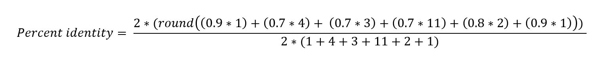

ATCG (Alignment-based Tool for Comparative Genomics) is a command-line tool for comparison of nucleotide sequences; it is intended for small-to-medium-sized datasets (e.g. plasmids; small collections of bacterial genomes). [BLAST](https://www.ncbi.nlm.nih.gov/books/NBK279690/) alignments are analysed to calculate various overall measures of pairwise sequence relatedness. The approach of ATCG is similar to that of a web-based tool called the genome-genome distance calculator ([GGDC](https://ggdc.dsmz.de/ggdc.php#)). However, ATCG provides more flexibility and additional analysis options such as assessment of structural similarity.


# Table of contents

* [Introduction](#Introduction)
* [Requirements](#Requirements)
* [Installation](#Installation)
* [Input](#Input)
* [Quick start](#Quick-start)
* [Background and methods](#Background-and-methods)
* [Options and usage](#Options-and-usage)
* [Output files](#Output-files)
* [Example](#Example)
* [FAQ](#FAQ)
* [License](#License)


# Introduction

As input, ATCG can take nucleotide sequence assemblies in [FASTA](https://en.wikipedia.org/wiki/FASTA_format) format; the assemblies can comprise any of the following:

* Complete genomes (e.g. plasmids; small collections of bacterial genomes)
* Complete metagenomes (e.g. sets of bacterial plasmids, where each set comprises plasmids from a single bacterial isolate)
* Incomplete genome/metagenome sequences (or a combination of complete/incomplete sequences). Incomplete sequences (contigs or scaffolds) must be affiliated to a known genome or metagenome and this affiliation is indicated in the sequence's FASTA header (see [Input](#Input))

ATCG is appropriate if you want to:
* Compare sequences in terms of overall relatedness metrics (genome-genome distances, percentage identity, coverage breadth)
* Use pairwise genome-genome distance scores to build a [distance-based](https://en.wikipedia.org/wiki/Distance_matrices_in_phylogeny) tree.
* Compare sequences in terms of their structural similarity (using the breakpoint distance metric; see [Henz _et al_. 2004](https://www.ncbi.nlm.nih.gov/pubmed/15166018))

ATCG is __not__ appropriate if you want to:
* Analyse many large genomes - alignment-based approaches are too time-consuming for this (instead, use locus-based typing methods such as [MLST](https://pubmlst.org/general.shtml) OR alignment-free comparative genomic tools such as [FastANI](https://github.com/ParBLiSS/FastANI))
* Generate a whole-genome multiple alignment (instead, use [progressiveMauve](http://darlinglab.org/mauve/user-guide/progressivemauve.html) or similar tool)


# Requirements

* Linux or MacOS (with the [Bash shell](https://en.wikibooks.org/wiki/Bash_Shell_Scripting#What_is_Bash?), which is the default shell on MacOS and many Linux distributions; tested using Bash versions 3.2, 4.1, 4.3)
* [Python](https://www.python.org/) 2.7 or Python 3 (tested using Python 3.5)
* [SeqKit](https://github.com/shenwei356/seqkit)
* [bioawk](https://github.com/lh3/bioawk)
* [BLAST+](https://www.ncbi.nlm.nih.gov/books/NBK279690/) (`blastn`)
* [GNU Parallel](https://www.gnu.org/software/parallel/)
* [R](https://www.r-project.org/) 3.3.1 or later with the following packages installed:
    * [GenomicRanges](https://bioconductor.org/packages/release/bioc/html/GenomicRanges.html); [gsubfn](https://cran.r-project.org/web/packages/gsubfn/index.html); [purrr](https://github.com/tidyverse/purrr); [foreach](https://cran.r-project.org/web/packages/foreach/index.html); [doParallel](https://cran.r-project.org/web/packages/doParallel/index.html); [data.table](https://cran.r-project.org/web/packages/data.table/index.html); [ape](https://cran.r-project.org/web/packages/ape/index.html)<br>

Run the following code in R to install the required R packages:<br>
```bash
source("https://bioconductor.org/biocLite.R")
biocLite("GenomicRanges")

install.packages("devtools",repo='https://cloud.r-project.org/')
library(devtools)
devtools::install_github("ggrothendieck/gsubfn")

install.packages("purrr",repo='https://cloud.r-project.org/')
install.packages("foreach",repo='https://cloud.r-project.org/')
install.packages("doParallel",repo='https://cloud.r-project.org/')
install.packages("data.table",repo='https://cloud.r-project.org/')
install.packages("ape",repo='https://cloud.r-project.org/')
```


# Installation

```bash
git clone https://github.com/AlexOrlek/ATCG.git
cd ATCG
```
You should find the atcg.py executable script within the repository directory. If you add the path of this directory to your [$PATH variable](https://www.computerhope.com/issues/ch001647.htm), then ATCG can be run by calling `atcg.py [`*`arguments...`*`]` from any directory location. Note also that ATCG expects the tools listed in [Requirements](#Requirements) to be available in your $PATH variable.

# Input

Sequences are provided in FASTA format, a flexibly-defined format comprising header lines (prefixed by ">") and sequences. Here, we follow the common convention where the header line is permitted to have two parts, separated by a space: the identifier and an optional comment after the first space. Information in the header identifier must be delineated using vertical bar(s) "|" and adhere to the format: `unit of analysis|subunit`. The `subunit` is only necessary when indicating affiliation of e.g. contigs with genomes, or of bacterial plasmids with bacterial isolates.

If comparing complete genomes, FASTA headers could be formatted as follows:<br>
genome1 additional information provided after the first space<br>
genome2<br>
genome3<br>

If comparing genomes where at least some genomes comprise contigs, FASTA headers could be formatted as follows:<br>
genome1|contig1 additional information provided after the first space<br>
genome1|contig2|additional information can also be provided in the identifier after genome|contig|<br>
genome2|contig1<br>
genome3|contig1

If comparing isolates in terms of their overall plasmid genetic content, FASTA headers could be formatted as follows:<br>
isolate1|plasmid1 additional information provided after the first space<br>
isolate1|plasmid2|additional information can also be provided in the identifier after isolate|plasmid|<br>
isolate2|plasmid1<br>
isolate2|plasmid2

# Quick start

For all-vs-all comparison, the tool can be run by providing a single multi-FASTA file using the `-s` flag; pairwise distance scores will be recorded and a tree will be generated.

`atcg.py -s genomes.fasta -o output-directory -t 8`


Alternatively, if all-vs-all comparison is not required, 2 input (multi-)FASTA files can be provided using flags `-s1` and `-s2`; pairwise comparisons will be conducted between but not amongst sequence(s) in each file; pairwise distances will be recorded but a tree will not be generated since distances are not available for all pairwise combinations. The order in which the FASTA files are provided to the -s1/-s2 flags will not affect results, however the sequences in the two files must be non-overlapping (ATCG will check this based on examination of the FASTA header identifiers).

`atcg.py -s1 query.fasta -s2 genomes.fasta -o output-directory -t 8`


# Background and methods

A paper describing the methods will be written shortly, and further information about the general approach can be found in a [paper](https://bmcbioinformatics.biomedcentral.com/articles/10.1186/1471-2105-14-60) by Meier-Kolthoff _et al_. describing the similar genome-genome distance calculator tool ([GGDC](https://ggdc.dsmz.de/ggdc.php#)). A brief outline of the steps of ATCG is given below:

1. BLAST is conducted on assembled nucleotide sequences in both directions between each pair of genomes (i.e. genome A vs genome B and genome B vs genome A; that is, with genome A as the [query sequence](https://www.ncbi.nlm.nih.gov/books/NBK1734/) and genome B as the subject database sequence, and vice-versa).
2. Where alignment ranges overlap at the same region on the query genome or the subject genome, the shorter overlapping alignment is trimmed to eliminate the overlap.
    * Trimming performed on the query/subject genome is applied to the corresponding range on the subject/query genome. Furthermore, the strand of the alignment is accounted for. So, if an alignment is '-' strand (a reverse complement alignment), and the alignment range on the query sequence is trimmed from the 5' end, then the corresponding alignment range on the subject sequence will be trimmed by the same length on the 3' end.
    * If an alignment is trimmed from the same flank on both query and subject genome, then a maximal trim is applied i.e. if the alignment trim lengths differ between genomes, then the shorter trim will be extended to match the longer trim.
The trimming algorithm used by ATCG is analogous to the "greedy-with-trimming" algorithm described by [Meier-Kolthoff _et al_](https://bmcbioinformatics.biomedcentral.com/articles/10.1186/1471-2105-14-60). See the [example](#Example) below for a visual depiction of how alignment trimming works. The rationale for trimming overlapping alignments is explained in the [FAQ](#FAQ) section. 
3. Calculation of distance metrics: Prior to trimming, the alignment coverage breadth on each genome is calculated. After alignment trimming, the trimmed alignments are used to calculate distance metrics; breakpoint distances and alignment length statistics can optionally be calculated using trimmed alignments. A description of the statistics produced by ATCG, and formulae for their calculation are given [here](misc/statistics_calculation.pdf).
4. If all-vs-all BLAST was run, then a tree is generated using a specified pairwise distance metric; optionally, the tree can be annotated with bootstrap confidence values, which are calculated by resampling trimmed alignments.


# Options and usage

`atcg.py --help` produces a summary of all the options.

By default, the number of threads is 1, but multi-threading is recommended to reduce computing time; the number of threads to use is specified using the `-t` flag; the value must not exceed the number of threads available on your machine. 
By default, breakpoint distance and alignment length distribution statistics are not calculated; bootstrap confidence values are also not calculated by default.
To conduct bootstrapping, the number of replicates is specified using the `-b` flag; trimmed alignments will be resampled with replacement to produce replicate distance scores, from which replicate trees are produced, allowing bootstrap confidence values to be shown on the original tree.
Calculation of breakpoint distance (a measure of structural similarity) is specified using the `--breakpoint` flag.
Calculation of alignment length distribution statistics is specified using the `--alnlenstats` flag. The alignment length statistics provide information on the distribution of BLAST alignment lengths and are analogous to the widely used [assembly contiguity statistics](https://www.molecularecologist.com/2017/03/whats-n50/) e.g N50/L50.

`atcg.py -s genomes.fasta -o output-directory -t 8 -b 100 --breakpoint --alnlenstats` runs the pipeline using 8 threads, with 100 bootstrap replicates, and calculation of breakpoint distance and alignment length distribution statistics.

To better understand the calculation of the various statistics, it may help to take a look at the [example](#Example) below.


# Output files

The below table shows the most important outputs from running the pipeline with the -s input flag. Similar outputs are produced using -s1 and -s2 input flags, but trees will not be produced.

File/Directory         | Description                                                                                       
---------------------- | -------------------------------------------------------------------------------------------------
splitfastas/           | directory containing FASTA files (and corresponding BLAST databases), derived from the input multi-FASTA, split by unit of analysis i.e. genome (or metagenome)
blast/		       | directory containing tsv files of blast alignments for each genome
included.txt           | names of genomes with detected blast alignments, that will therefore appear in the distancestats.tsv file
excluded.txt	       | names of any genomes with no detected blast alignments (this file may well be blank)
fastafilepaths.tsv     | genomes and corresponding FASTA file paths
blastdbfilepaths.tsv   | genomes and corresponding BLAST database file paths
seqlengths.tsv         | genomes and their lengths in bp
output/		       | directory containing output files described below
distancestats.tsv      | columns of distance statistics for each unique pairwise combination of genomes
tree_[score].pdf       | tree generated using a specified distance score column from the distancestats.tsv file; plotted as a pdf
tree_[score].rds       | as above, but stored as an [rds file](https://stat.ethz.ch/R-manual/R-devel/library/base/html/readRDS.html) which can be read, and the tree replotted 
distobject_[score].rds | a "dist" object distance matrix derived from distancestats.tsv, stored as an rds file

If bootstrapping is specified, a pdf showing the original tree with bootstrap confidence values (tree\_[score]\_bootstrapped.pdf) is produced instead of tree_[score].pdf. Also, the following additional files will be generated in the output directory:<br>
A file containing distance statistics for each bootstrap replicate (distancestats_bootstrapped.tsv)<br>
A list of replicate trees, that were used to calculate confidence values for the original tree, stored as an rds file (tree\_[score]\_bootstrapped.rds)


# Example

To clarify the calculation of statistics, the alignment trimming and statistics calculation stages of the ATCG pipeline can be run on simple example BLAST output files (found within the example/blast directory). To run the example, call the following code from within the example directory:

`Rscript granges_example.R`

Results are produced in the example/output directory. Diagrams below show the alignments before trimming and after trimming; calculation of the statistics in the output directory can be done manually for the benefit of understanding, as is shown below for the calculation of percent identity.

<br>
<p align="center">Untrimmed alignments</p>
<p align="center"></p>
<br>
<p align="center">Trimmed alignments</p>
<p align="center"></p>
<br>
<p align="center">Calculation of percent identity from trimmed alignments</p>
<p align="center"></p>


__Things to note:__<br>
<br>
Notice how the red alignment is involved in alignment trimming: it overlaps with the blue alignment on sequence B and since the red alignment is longer, the blue alignment is trimmed. The red alignment also overlaps with the green alignment on sequence A; in this case, it is the shorter of the two alignments, so it is trimmed. However, because it is a '-' strand alignment, it is trimmed from the 3' end on sequence B.<br>

The orange alignment overlaps with the longer pink alignment on the same flank in both genome A and B. In this case, maximal trimming is applied, as described in the [Background and methods](#Background-and-methods) section.<br>

The breakpoint distance is 1 meaning there were no pairs of sequences found to be adjacent and in the same relative order in sequence A and sequence B. While the green and red alignments are adjacent in both sequence A and B, one is '+' strand and the other is '-' strand so they are not in the same relative order.<br>

For the percent identity calculation, the numerator and denominator are multiplied by 2. This is because the number of identical basepairs (numerator) and the alignment length (denominator) are the same in both BLAST directions. However, BLAST is not always symmetric; this is the rationale for aggregating across both BLAST directions. 

# FAQ

* **Why is it necessary to trim overlaps prior to calculating distance metrics?**
Overlapping alignments may reflect a scenario where mutliple duplicate stretches of repeat sequence from one genome map to a single homologous stretch in the other genome (as in the orange and pink alignments in the [example](#Example) above). Trimming overlapping alignments therefore reduces bias from repetitive sequences. [Previous authors](https://academic.oup.com/bioinformatics/article/21/10/2329/205556) have shown that trimming overlapping alignments improves distance-based species delimitation.
* **What happens if there are no BLAST alignments between two genomes?**
Pairwise comparisons yielding no BLAST alignments will not be included in the output. Genome(s) with no BLAST alignments to any other genome(s) will be recorded in the excluded.txt file.
* **Which distance metric should be used?**
Different distance metrics reflect different distance concepts. Some distance scores focus on coverage breadth (d0-d3); others focus on percent identiy (d4,d5); while others reflect both percent identity and coverage breadth (d6-d9). In addition, there are two overarching distance concepts by which the scores can be categorised: [resemblance and containment](https://genomeinformatics.github.io/mash-screen). Resemblance is not robust to genome size difference, so if a smaller genome matches exactly to part of a larger genome, the distance will be >0, but according to containment, the distance score should be 0. Scores d0, d2, d6, and d8 represent resemblance, while scores d1, d3, d7, and d9 represent containment.
* **What are the advantages of ATCG compared with other comparative genomics tools?**
ATCG measures structural similarity which is not possible when using (faster) alignment-free approaches. Although GGDC is also a BLAST alignment-based approach, a structural similarity metric is not provided. Other advantages of ATCG compared with GGDC are as follows:
    * ATCG is a standalone command-line tool, so it can be used with a computer cluster; there is no limit to the number of input genomes; output can be flexibly specified in the command-line. 
    * ATCG produces all described distance scores d0-d9 whereas the web GGDC only provides a subset. ATCG also generates additional more easily interpretable metrics: percent identity and pre-trimming coverage breadth of each genome.


# License

[MIT License](https://en.wikipedia.org/wiki/MIT_License)